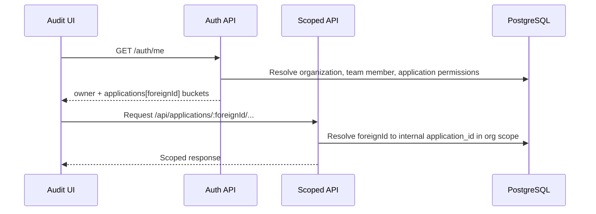

The Audit UI is a React/Vite application. It does not execute end-user privacy-pool transfers. It consumes authenticated backend APIs for organization management, application workspaces, disclosure cases, reports, and activity logs.

## Workspace routes

| Workspace | Routes | Backing scope |
| --- | --- | --- |
| Organization owner | `/workspace/organization-owner/overview`, `/applications`, `/team`, `/activity`, `/reports` | `auth/me.owner` permissions |
| Application | `/workspace/application/:foreignId/overview`, `/cases`, `/cases/new`, `/cases/:caseId`, `/disclosure`, `/reports`, `/log`, `/settings` | `auth/me.applications[foreignId]` permission buckets |

Legacy routes under `/workspace/application-auditor/:foreignId/*` and `/workspace/application-administrator/:foreignId/*` redirect to the unified application workspace.

## Route resolution

## Navigation permissions

Application workspace navigation:

| Nav item | Required permission |
| --- | --- |
| Case Review | `reports:view_transactions` |
| Disclosure Requests | `cases:approve_creation` |
| Reports | `reports:list` |
| Audit Log | `logs:view_activity` |

Case workspace tabs:

| Tab | Required permission |
| --- | --- |
| Review | `reports:view_transactions` |
| Case Auditors | `reports:view_transactions` |
| Activity | `reports:view_transactions` |
| Reports | `reports:list` |

UI checks hide unavailable navigation. Backend guards still enforce access for every protected route.

## Organization owner workspace

| Route | Main use |
| --- | --- |
| `/workspace/organization-owner/overview` | Organization landing page |
| `/workspace/organization-owner/applications` | Application list and creation |
| `/workspace/organization-owner/team` | Team members and permissions |
| `/workspace/organization-owner/activity` | Organization activity log |
| `/workspace/organization-owner/reports` | Organization report list and downloads |

## Application workspace

| Route | Main use |
| --- | --- |
| `/workspace/application/:foreignId/overview` | Application landing page |
| `/workspace/application/:foreignId/cases` | Case review queue and worklist |
| `/workspace/application/:foreignId/cases/new` | Disclosure case request form |
| `/workspace/application/:foreignId/cases/:caseId` | Approved case workspace |
| `/workspace/application/:foreignId/disclosure` | Disclosure request registry for application administrators |
| `/workspace/application/:foreignId/reports` | Application report list |
| `/workspace/application/:foreignId/log` | Application activity log |
| `/workspace/application/:foreignId/settings` | Application settings |
