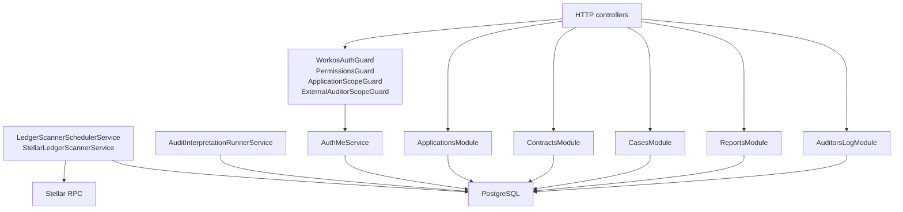

The backend is a NestJS application with TypeORM and scheduled jobs.

## Runtime modules

`AppModule` imports the runtime modules below.

| Module | Area |
| --- | --- |
| `ConfigModule` | Environment parsing and runtime configuration |
| `ScheduleModule` | Scanner and interpretation intervals |
| `TypeOrmModule` | PostgreSQL connection, entities, migrations |
| `BlockchainModule` | Chain metadata |
| `ContractsModule` | Pool contracts and keys |
| `AssetsModule` | Asset metadata |
| `ApplicationsModule` | Applications and route segments |
| `ScannerModule` | Stellar/Solana scanner providers and scheduled scanner service |
| `AuditModule` | Raw audit rows and audit query endpoint |
| `AuditInterpretationModule` | Interpretation worker and interpreted records |
| `AuthModule` | `GET /auth/me`, permissions, guards |
| `WorkosAuthModule` | WorkOS identity implementation |
| `MagicAuthModule` | OTP authentication implementation |
| `AdminsModule` | Organization, team, and access administration |
| `CasesModule` | Case requests, approvals, case review, assignments |
| `DisclosureRequestModule` | Disclosure request storage and status model |
| `ReportsModule` | Report generation, listing, download |
| `AuditorsLogModule` | Activity-log staging, persistence, list, export |

## Backend component map

## API groups

Representative API groups:

| API group | Example route | Main checks |
| --- | --- | --- |
| Auth | `GET /auth/me` | Authenticated identity |
| Applications | `POST /api/applications`, `GET /api/applications` | Owner application permissions |
| Contracts | `POST /api/contracts` | Auth and contract-management checks |
| Audit rows | `GET /api/audit/contract/:contractId` | `reports:view_transactions` |
| Cases | `/api/applications/:foreignId/cases/...` | Application scope, case permissions, assignments |
| Admin case decisions | `/api/applications/:foreignId/case-requests/:id/approve` | `cases:approve_creation` |
| Reports | `/api/reports`, `/api/applications/:foreignId/reports`, `/api/applications/:foreignId/case-reports` | `reports:create`, `reports:list`, `reports:download` |
| Activity log | `/api/auditors-log`, `/api/applications/:foreignId/auditors-log`, `/api/applications/:foreignId/cases/:caseId/auditors-log` | `logs:view_activity` or `reports:view_transactions` |
| Team/admin | `/api/admin/team/...` | Organization owner and team-management checks |

## Scheduled jobs

| Job | Service | Purpose |
| --- | --- | --- |
| Stellar scanner tick | `LedgerScannerSchedulerService` -> `StellarLedgerScannerService` | Scan configured Stellar chain names for registered contracts |
| Solana scanner tick | `LedgerScannerSchedulerService` | Scan configured Solana chain names through the Solana path |
| Interpretation batch | `AuditInterpretationRunnerService` | Lock uninterpreted rows and write normalized interpretation rows |

The Stellar/Soroban pages focus on the Stellar privacy-pool scanner. The Solana confidential-token path shares backend workflow tables after normalization but is a separate chain adapter.

## Enforcement surfaces

Server-side enforcement uses:

| Mechanism | Purpose |
| --- | --- |
| `WorkosAuthGuard` | Verifies authenticated session/JWT |
| `PermissionsGuard` | Checks required permission keys |
| `ApplicationScopeGuard` | Resolves `:foreignId` and attaches internal `applicationId` |
| `ExternalAuditorScopeGuard` | Restricts external auditor access where used |
| Query-level org/application filters | Prevent cross-organization and cross-application reads |
| Case assignment checks | Restrict case review to assigned auditors |
| Case access-window checks | Enforce `access_days` expiration |

Client-side permission checks shape navigation. API guards and scoped queries are the source of truth.
