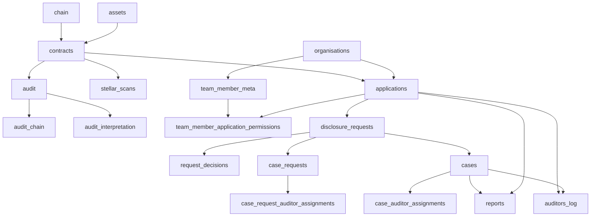

The backend stores registry, audit, interpretation, access, workflow, report, and activity-log data in PostgreSQL through TypeORM entities and migrations.

## Core relationship map

## Registry and chain configuration

| Table | Purpose |
| --- | --- |
| `chain` | Chain name, type (`stellar` or `solana`), RPC URL, Stellar network passphrase, initial ledger hint |
| `contracts` | Contract address, chain id, decoding key, encoding key |
| `assets` | Asset metadata and Stellar asset contract fields |
| `asset_pool_contracts` | Asset-to-contract link table |
| `applications` | Organization application, `foreign_id`, display fields, `application_type`, contract association |

## Audit pipeline

| Table | Purpose |
| --- | --- |
| `stellar_scans` | Per contract/chain scan checkpoint with `block_start`, `block_end`, `last_signature` |
| `audit` | Raw audit event row, unique by `(contract_id, soroban_event_id)` |
| `audit_chain` | Many-to-many link from audit row to chain |
| `audit_interpretation` | Normalized interpretation rows, unique by `(audit_id, seq)` |
| `token_transfers` | Parsed token transfer rows where available |

## Access and workflow

| Table | Purpose |
| --- | --- |
| `organisations` | Arcane organization record keyed by external org id |
| `team_member_meta` | Team member identity, invitation, role, org, expiry, and owner-level permissions |
| `team_member_application_permissions` | Per-application `common`, `administrator`, and `auditor` permission arrays |
| `disclosure_requests` | Parent request: org, application, requester, reason, status, type, approval count |
| `request_decisions` | Approve/reject decision records |
| `case_requests` | Case-specific period, access window, disclosure flags, future case id, contract filters |
| `cases` | Approved case id, source request, contract addresses, access duration |
| `case_request_auditor_assignments` | Request-time auditor assignments |
| `case_auditor_assignments` | Active case auditor assignments with soft-delete history |
| `reports` | Report blob, metadata, type, creator, org/application scope |
| `auditors_log` | Compliance activity events, actor, org, application, case, object, details |

## Application registry

An Arcane application is a backend record, not the same thing as a deployed frontend.

`applications` fields used by the architecture:

- `org_id` scopes the application to one organization.
- `foreign_id` is the stable route/API segment exposed to the Audit UI and application-scoped APIs.
- `application_type` distinguishes `stellar-pool` from `solana-confidential-token`.
- `association.contract_id` links the application to a registered contract row.

The UI route is `/workspace/application/:foreignId`. Application-scoped API routes use `/api/applications/:foreignId/...`. The backend resolves that route segment to an internal `application_id` before permission and query execution.
