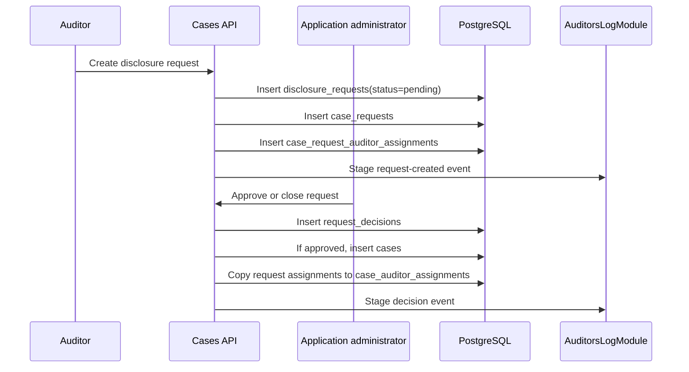
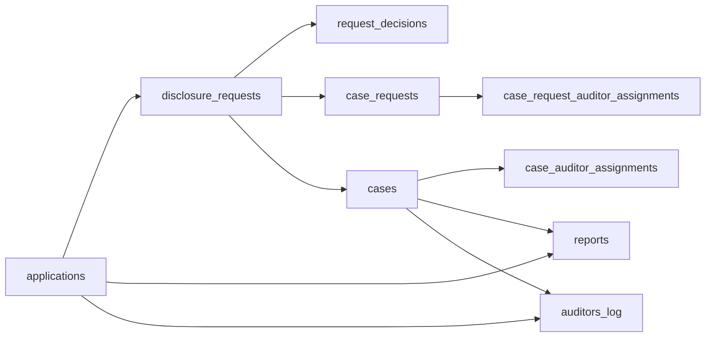

Disclosure workflows give authorized users scoped access to interpreted audit data. The scope is stored in disclosure and case tables, enforced by API guards and queries, and recorded in `auditors_log`.

## Lifecycle

Supported status values are `pending`, `approved`, and `closed`.

Auditors can withdraw pending requests they created when they have `cases:withdraw_pending_request`. Application administrators can approve or close pending requests when they have `cases:approve_creation`.

## Data model

## Tables

| Table | Purpose |
| --- | --- |
| `disclosure_requests` | Parent request with org, application, requester, reason, status, type, approvals required |
| `request_decisions` | Administrator approve/reject decisions and reasons |
| `case_requests` | Case period, access duration, disclosure flags, future case id, optional contract filters |
| `case_request_auditor_assignments` | Auditor assignments proposed at request time |
| `cases` | Approved investigation case |
| `case_auditor_assignments` | Active case auditor assignments; removed assignments are soft-deleted |
| `reports` | Generated report files and metadata |
| `auditors_log` | Activity trail for request, decision, case, report, team, and application actions |

## Main endpoints

| Endpoint | Purpose | Main permission |
| --- | --- | --- |
| `GET /api/applications/:foreignId/disclosure-registry` | Administrator disclosure request registry | `cases:approve_creation` |
| `GET /api/applications/:foreignId/cases` | Case list and auditor worklist | `reports:view_transactions` or case/admin-specific checks |
| `POST /api/applications/:foreignId/cases` | Create disclosure case request | `cases:create` |
| `POST /api/applications/:foreignId/cases/requests/:id/withdraw` | Withdraw own pending request | `cases:withdraw_pending_request` |
| `POST /api/applications/:foreignId/case-requests/:id/approve` | Approve request | `cases:approve_creation` |
| `POST /api/applications/:foreignId/case-requests/:id/close` | Close request | `cases:approve_creation` |
| `POST /api/applications/:foreignId/case-reports` | Generate transaction summary report | `reports:create` |
| `GET /api/applications/:foreignId/case-reports` | List application case reports | `reports:list` |
| `GET /api/applications/:foreignId/case-reports/:reportId/download` | Download application case report | `reports:download` |
| `GET /api/applications/:foreignId/auditors-log` | Application activity log | `logs:view_activity` |
| `GET /api/applications/:foreignId/cases/:caseId/auditors-log` | Case activity log | `reports:view_transactions` |

## Transaction review scope

Case transaction review reads interpreted records after these filters:

| Filter | Source |
| --- | --- |
| Organization | Authenticated session `orgId` |
| Application | `:foreignId` resolved to `application_id` |
| Case | `cases.id` |
| Period | `case_requests.period_from`, `case_requests.period_to` |
| Contract address | `case_requests.investigation_contract_addresses` or `cases.contract_addresses` |
| Assignment | `case_auditor_assignments` |
| Access window | `cases.created_at + access_days` |
| Field scope | `full_tx_ids`, `sender_information`, `withdrawal_details` |

Interpreted audit rows outside this scope are not returned for the case.

## Reports

Report rows contain:

- `id`
- `org_id`
- `application_id`
- `file_blob`
- `metadata`
- `type`
- `created_by_user_id`
- `created_by_email`
- `created_by_name`
- `created_at`

Report boundaries:

| Boundary | Endpoint |
| --- | --- |
| Application case reports | `GET /api/applications/:foreignId/case-reports`, `GET /api/applications/:foreignId/case-reports/:reportId/download` |
| Case transaction summary | `POST /api/applications/:foreignId/case-reports` |
| Activity log CSV exports | `GET /api/auditors-log/export.csv`, `GET /api/applications/:foreignId/auditors-log/export.csv`, `GET /api/applications/:foreignId/cases/:caseId/auditors-log/export.csv` |

Report generation, report download, and activity-log export are separate permission checks and separate activity-log events where the backend records them.

## Activity log

`auditors_log` records:

| Column | Meaning |
| --- | --- |
| `event_type` | Action type |
| `user` | Actor display field |
| `org_id` | Organization scope |
| `user_id` | Internal actor user id |
| `workos_user_id` | External identity user id |
| `object` | Typed target object JSON |
| `details` | Typed event details JSON |
| `application_foreign_id` | Optional application route segment |
| `case_id` | Optional case id |
| `created_at` | Event timestamp |

Events are persisted after successful handler execution, so failed requests do not produce success log entries.
