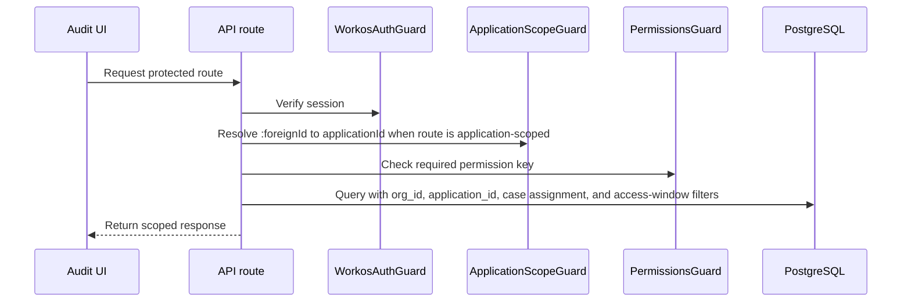

Identity and access control which organization, application, case, report, transaction, and activity-log data a portal user can access.

The codebase implements enterprise identity with WorkOS modules and email OTP with Magic Auth. The architecture boundary is the authenticated session and the `GET /auth/me` permission response consumed by the Audit UI and API guards.

## Identity implementation

| Component | Responsibility |
| --- | --- |
| `WorkosAuthModule` | WorkOS-backed authentication, organization selection, session/JWT flow |
| `MagicAuthModule` | Email OTP authentication flow |
| `WorkosAuthGuard` | Backend route guard for authenticated API requests |
| `OrganisationSessionService` | Organization-session handling |
| `AuthMeService` | Session-to-permission mapping |

Session identity is mapped to:

- Selected organization id.
- User id and email.
- Team member metadata in `team_member_meta`.
- Owner-level permissions from organization/team metadata.
- Application-level permissions from `team_member_application_permissions`.

## Access storage

| Table | Fields used for access |
| --- | --- |
| `organisations` | Organization id and display metadata |
| `team_member_meta` | `org_id`, `workos_invitation_id`, `workos_user_id`, `invite_email`, `full_name`, `role_slug`, `permissions`, `external_org`, `access_expires_at` |
| `applications` | `org_id`, `foreign_id`, `name`, `application_type`, `association.contract_id` |
| `team_member_application_permissions` | `team_member_meta_id`, `application_id`, `common_permissions`, `administrator_permissions`, `auditor_permissions` |
| `case_auditor_assignments` | Case-level assignment for auditor worklists and case access |

## `GET /auth/me`

`GET /auth/me` returns the organization, owner permissions, and application permission buckets for the current session.

```json
{
  "organization_info": { "org_id": "org_...", "name": "Example Org" },
  "owner": { "applications:read": true },
  "applications": {
    "payments-demo": {
      "application_info": { "name": "Payments Demo" },
      "common": { "logs:view_activity": true },
      "administrator": { "cases:approve_creation": true },
      "auditor": { "reports:view_transactions": true }
    }
  }
}
```

Important keys:

- `owner` contains organization owner permissions.
- `applications[foreignId]` contains per-application buckets.
- `foreignId` is `applications.foreign_id`, also used in `/workspace/application/:foreignId` and `/api/applications/:foreignId/...`.

## Workspace resolution

The UI builds available workspaces from `auth/me`.

| UI workspace | Condition | Route |
| --- | --- | --- |
| Organization owner | At least one `owner` permission is granted | `/workspace/organization-owner/*` |
| Application | At least one permission bucket exists for `applications[foreignId]` | `/workspace/application/:foreignId/*` |

Navigation is filtered by permission keys. API checks still enforce access server-side.

## Owner permissions

Granted at organization scope.

| Permission | Key |
| --- | --- |
| Create applications | `applications:create` |
| Read applications | `applications:read` |
| Manage application administrators | `admins:manage_application_administrators` |
| View organization activity log | `logs:view_activity` |
| Create organization reports | `reports:create` |
| List organization reports | `reports:list` |
| Download organization reports | `reports:download` |

## Application permission buckets

Application permissions are stored as three arrays on `team_member_application_permissions`.

### Common

| Permission | Key |
| --- | --- |
| View activity log | `logs:view_activity` |

### Administrator

| Permission | Key |
| --- | --- |
| Approve case creation | `cases:approve_creation` |
| Edit case auditors | `cases:edit` |

### Auditor

| Permission | Key |
| --- | --- |
| Create cases | `cases:create` |
| Withdraw pending case requests | `cases:withdraw_pending_request` |
| View transactions | `reports:view_transactions` |
| Create application reports | `reports:create` |
| List application reports | `reports:list` |
| Download application reports | `reports:download` |

Default role buckets are defined in `permissions.constants.ts`. Organization owners can adjust access through team-management flows.

## API enforcement path



Application-scoped routes do not trust the client to provide internal `application_id`. The server derives it from `:foreignId` and the authenticated organization.

## Case-level access

Application permission is necessary but not always sufficient.

Case review additionally checks:

- Case belongs to the same organization.
- Case belongs to the resolved application.
- Case request is not withdrawn.
- Case has been approved.
- User is assigned through `case_auditor_assignments` when auditor-scoped.
- Case access has not expired under `access_days`.
- Requested fields are within the approved disclosure flags.

This is the access boundary for interpreted transaction data.
