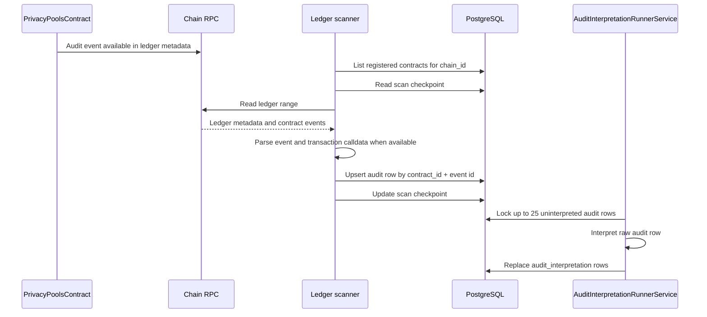

Indexing and interpretation are separate backend stages. Indexing writes raw encrypted `audit` rows from chain events. Interpretation decrypts those rows and writes normalized `audit_interpretation` rows used by cases, reports, and review screens.

This page describes portal infrastructure. It is not a partner SDK integration guide.

## End-to-end pipeline



## Scanner runtime components

| Component | Responsibility |
| --- | --- |
| `ScannerModule.register` | Registers scanner providers for configured Stellar and Solana chain names |
| `StellarRpcModule.register` | Loads a `chain` row by name, validates `type = stellar`, creates a Stellar RPC client |
| `LedgerScannerSchedulerService` | Runs bootstrap scan and scheduled scan ticks |
| `StellarLedgerScannerService` | Lists contracts for one Stellar chain and scans each contract |
| `performStellarContractScan` | Calculates ledger span from checkpoint, RPC retention, and scanner config |
| `collectStellarAuditRows` | Reads ledger pages and collects accepted audit rows |
| `buildAuditFromStellarEvent` | Maps Soroban event and calldata into an `audit` upsert object |
| `persistScanResultsQuery` | Upserts `audit`, writes `audit_chain`, updates scan checkpoints |

## Contract selection

The scanner does not scan arbitrary chain activity.

```text
chain -> contracts(chain_id) -> scanner service
```

`applications.association.contract_id` links an Arcane application to a registered contract. That link is used later by application-scoped API routes and disclosure workflows.

## Ledger span selection

For each contract, the scanner determines:

| Input | Source |
| --- | --- |
| Previous checkpoint | Scan checkpoint for `(contract_id, chain_id)` |
| Initial hint | Chain-specific initial ledger config |
| RPC lower bound | RPC ledger retention metadata |
| RPC tip | Latest ledger sequence |
| Batch size | Scanner batch configuration |

The next scan starts after the previous checkpoint and clamps to the RPC lower bound when needed. If the next ledger is past the RPC tip, the scan is skipped for that contract.

## Event parsing

For each ledger page:

1. Read ledger metadata from RPC.
2. Extract contract events for the registered contract address.
3. Ignore events that are not in successful contract calls.
4. Read transaction calldata from ledger metadata when available.
5. Map the current audit topic to the raw audit event type.

The current Stellar privacy-pool contract emits `AuditEncodedDigest` under the `audit` topic with `message_name = "transact"`.

## Raw audit row

The scanner writes one `audit` row per accepted event.

| Column | Source |
| --- | --- |
| `contract_id` | Registered `contracts.id` |
| `tx_id` | Event transaction hash |
| `soroban_event_id` | Stellar event id; unique with `contract_id` |
| `event_type` | `transact` for current `AuditEncodedDigest` events |
| `cyphertext` | Sealed audit payload from the event value |
| `created_at` | Ledger close time |
| `interpreted` | `false` until interpretation succeeds |
| `signer_account` | Signer resolved from transaction calldata, fallback `unknown` |
| `public_signals_json` | Parsed transaction public signals |
| `interpretation_error` | Last interpretation error, if any |

The scanner also writes `audit_chain` and advances scan checkpoints. The `audit` table is unique by `(contract_id, soroban_event_id)`.

## Interpretation runner

`AuditInterpretationRunnerService` runs on a 12-second interval.

Batch behavior:

1. Open a database transaction.
2. Lock up to 25 uninterpreted audit rows.
3. Route Solana confidential-token rows to `interpretCtAuditRow`.
4. Route all other rows to `interpretStellarAuditRow`.
5. Replace interpretation rows for each successfully interpreted audit row.
6. Store a truncated interpretation error on the source audit row if interpretation fails.

## Stellar interpretation path

`interpretStellarAuditRow` performs:

| Step | Detail |
| --- | --- |
| Decode-key check | Requires `audit.contract.decoding_key` |
| Public signal parsing | Validates `audit.public_signals_json` |
| Payload decode | Calls `decryptAndDecodeTransaction(cyphertext, decoding_key)` |
| Planning | Calls `planInterpretations(tx, publicSignals)` |
| Persistence | Replaces rows in `audit_interpretation` for `audit_id` |
| Error capture | Writes `audit.interpretation_error` |

Interpretation is backend processing. It does not grant auditor visibility by itself.

## Interpreted records

`audit_interpretation` rows are normalized records.

| Column | Description |
| --- | --- |
| `audit_id` | Source raw audit row |
| `seq` | Sequence when one audit row creates multiple interpreted rows |
| `kind` | Normalized kind: `deposit`, `withdraw`, or `transfer` |
| `payload` | JSONB payload used by case review and reports |
| `amount_stroops` | Parsed amount when available |

The unique key is `(audit_id, seq)`.

## Event type versus interpretation kind

| Level | Example | Meaning |
| --- | --- | --- |
| Raw event | `transact` | Contract-call shape indexed from chain |
| Interpretation kind | `deposit`, `withdraw`, `transfer` | Normalized branch planned from decrypted transaction data and public signals |

A single raw `transact` event can produce multiple interpreted rows.

## Failure behavior

| Failure | Effect |
| --- | --- |
| No contracts for chain | Scanner logs and returns |
| RPC retention moved past checkpoint | Start ledger clamps to the oldest retained ledger |
| RPC/network failure | Scan cycle logs an error; checkpoint is not advanced for failed work |
| Parser returns no audit row | Event is ignored |
| Duplicate event | Upsert updates the existing `audit` row |
| Missing decoding key | Interpretation error is written to `audit.interpretation_error` |
| Decryption or planning failure | Interpretation error is written; indexing is not rolled back |
