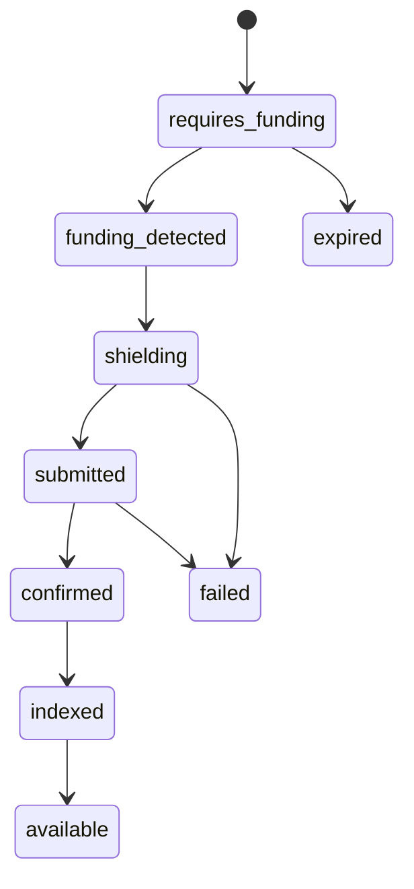

A funding intent represents a planned public-to-private funding action.

It gives your application a stable object for deposit instructions, public funding detection, shielding, status tracking, and reconciliation.

## Why it exists

Without a funding intent, your backend has to infer product meaning from raw chain transfers. That is fragile for card funding, payroll, and treasury workflows.

With a funding intent, each public funding action has:

- A private account target.
- An expected amount and asset.
- A chain and funding address.
- A product reference.
- A status lifecycle.
- An audit record.

## Lifecycle

## Product mapping

| Product | Funding intent maps to |
| --- | --- |
| Card program | Card-load or card-funding session |
| Payroll | Employer deposit or payroll-cycle funding |
| Treasury | Settlement or liquidity movement |
| Wallet | User deposit session |

Use `external_reference` to connect the funding intent to your product object.
