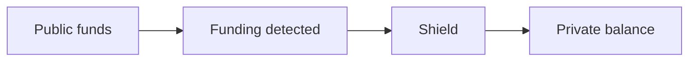
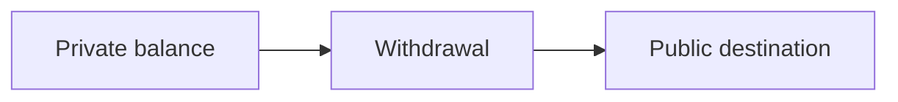

Shielding moves value from public chain state into Arcane private state. Unshielding moves value from private state back to a public destination.

## Shielding

Shielding is used for:

- Card funding.
- Payroll treasury deposits.
- User wallet deposits.
- Application treasury funding.

In the current SDK-backed integration, shielding is usually driven by a partner-owned funding session or product record.

## Unshielding

Unshielding is used for:

- User withdrawals.
- Treasury settlement.
- Payroll payout to a public address.
- Liquidity movement between public and private systems.

In the current SDK-backed integration, unshielding is usually driven by a partner-owned withdrawal or payout record.

## Status distinction

Do not treat chain confirmation and Arcane indexing as the same event.

| Event | Meaning |
| --- | --- |
| Chain confirmed | The public chain accepted the transaction |
| Arcane indexed | Arcane processed the private state |
| Product complete | Your ledger or product state has been updated |

Keep those states separate in your backend.
