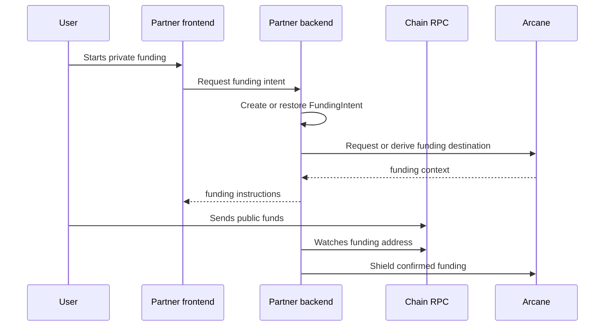

This guide walks through the first successful integration path. It uses a card-funding style flow because it exercises the main primitives: intent creation, public funding, shielding, status tracking, and reconciliation.

The same lifecycle also applies to payroll, treasury, wallet, and embedded finance integrations.

## Before you begin

You need:

- An Arcane environment with SDK access for the selected rail.
- Hosted API credentials only if Arcane has enabled hosted API access for your environment.
- A partner backend that can store product references and call the Arcane SDK, indexer, relayer, or hosted API.
- A chain RPC endpoint for the rail you are testing.
- A test asset such as native SOL, test USDC, or a Stellar testnet asset.

For local testing, see [Sandbox / Testnet Setup](/get-started/sandbox-testnet-setup).

## Step 1: Create or retrieve a private account

Create a `PrivateAccount` for the product identity that will own private balance.

Examples:

| Product identity | Private account scope |
| --- | --- |
| Cardholder | One private account per cardholder or card funding profile |
| Employee | One private account per employee |
| Employer treasury | One private account per treasury wallet or payroll program |
| Application wallet | One private account per partner application environment |

Store both ids:

| Field | Stored by |
| --- | --- |
| Partner user, card, payroll, or treasury id | Partner backend |
| Arcane `private_account_id` | Partner backend and Arcane |

Do not expose backend signing keys, proof authority, decoded UTXOs, or encrypted output caches to the browser.

## Step 2: Create a funding intent

Create a `FundingIntent` when the user or partner system starts a private funding action. In the current SDK integration, this can be your own backend resource that maps product state to Arcane operations. If hosted API access is enabled, Arcane may create and store the hosted `FundingIntent` resource.

```json
{
  "private_account_id": "pa_...",
  "amount": "100.00",
  "asset": "USDC",
  "chain": "solana",
  "external_reference": "card_load_123",
  "metadata": {
    "product": "card_funding"
  }
}
```

The response should give your backend a stable intent id and a funding destination for the selected rail.

```json
{
  "id": "fi_...",
  "status": "requires_funding",
  "chain": "solana",
  "asset": "USDC",
  "amount": "100.00",
  "funding_address": "..."
}
```

## Step 3: Show the funding action

Your frontend shows the product action in normal language.

For a card funding product, show:

- The amount and asset.
- The public funding address or wallet action.
- The current status.
- A cancellation or timeout state if your product supports it.

The frontend should not call low-level privacy-layer functions directly in a backend-managed integration.

## Step 4: Detect public funding

Your backend watches for public funding on the selected chain. After the expected transfer is visible, update the funding intent status to `funding_detected`.



## Step 5: Shield funds into private balance

After public funding is detected, your backend calls Arcane through the SDK, or through the hosted API if Arcane has enabled it for your environment, to shield the funds.

For a Solana SDK integration, this maps to the deposit flow described in [Solana SDK](/sdks/solana-sdk) and [Backend-Managed Wallets](/sdks/backend-managed-wallets).

The shielding operation should:

- Create private output state.
- Generate or request the required proof.
- Submit the transaction through the relayer or wallet path.
- Persist operation history for reconciliation.
- Advance status when the transaction is confirmed and indexed.

## Step 6: Track status

Your backend should track the lifecycle until Arcane confirms indexed private state.

| Status | Meaning |
| --- | --- |
| `requires_funding` | The intent exists and waits for public funds |
| `funding_detected` | The public transfer was observed |
| `shielding` | Arcane is creating private state |
| `submitted` | A transaction was submitted to the chain or relayer |
| `confirmed` | The chain confirmed the transaction |
| `indexed` | Arcane indexed the private state |
| `available` | The private balance is ready for product use |
| `failed` | The operation needs retry or manual review |
| `expired` | The funding window closed before completion |

Use webhooks when available and polling as a fallback. See [Status Lifecycle](/operations/status-lifecycle) and [Webhooks and Retries](/operations/webhooks-and-retries).

## Step 7: Reconcile or disclose

After the intent reaches `available`, your application can complete the product action.

For card funding, this usually means:

- Link the private funding event to the card-load record.
- Mark the card balance or treasury instruction as ready.
- Store the Arcane transaction id and audit record id.
- Keep customer-facing history simple.
- Keep compliance and support history permissioned.

For payroll, this usually means:

- Link the private transfer to payroll cycle, employee, employer, and accrual records.
- Keep external chain activity private.
- Preserve an authorized disclosure path for disputes, tax, or regulatory review.

## Next guides

<Columns cols={2}>
  <Card title="Private card funding" icon="credit-card" href="/integration-guides/private-card-funding">
    Build a private card-load or card-funding flow.
  </Card>
  <Card title="Private payroll flows" icon="timer" href="/integration-guides/private-payroll-flows">
    Apply the same model to payroll, streaming, and employee payouts.
  </Card>
</Columns>
