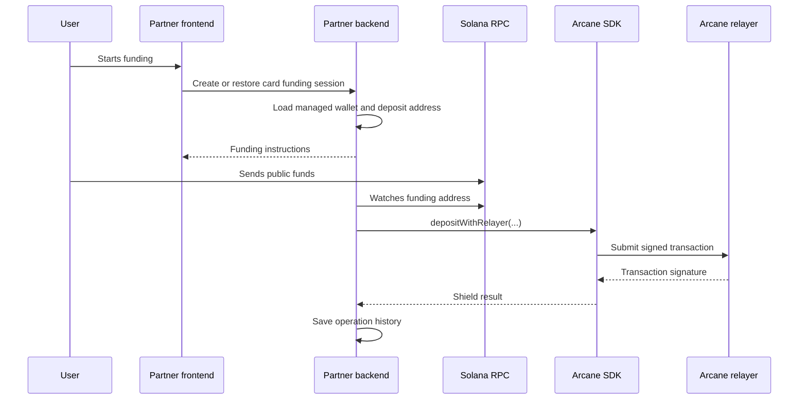

This guide walks through the first successful backend-managed Solana flow: create or restore a managed wallet, show a funding address, detect public funds, shield them with the SDK, scan private state, and reconcile the product result.

It uses a card-funding style example, but the same mechanics apply to payroll, treasury, wallet, and embedded finance integrations.

## Before you begin

You need:

- Arcane SDK source or package access for the selected rail.
- A partner backend that can store product records, managed wallet state, scan state, and operation history.
- A Solana RPC endpoint for the environment you are testing.
- Arcane indexer, relayer, Light RPC, and prover configuration for direct SDK use.
- A test asset such as native SOL or test USDC.

For local testing, see [Sandbox / Testnet Setup](/get-started/sandbox-testnet-setup).

## Step 1: Create or restore the managed wallet

When the user opens the funding flow, your frontend identifies the user or product actor and calls your backend.

For wallet-authenticated products, the frontend sends the user's external Solana wallet public key. Your backend uses that value as the owner scope.

Your backend should create or load a wallet row with:

| Field | Purpose |
| --- | --- |
| `owner_wallet_public_key` | External wallet or product identity used to find the row |
| `managed_public_key` | Backend-managed public key used by the SDK |
| Signing key reference | KMS, HSM, or encrypted key reference for the managed signer |
| `proof_signature_base58` | Stable proof authority signature used for private key derivation |
| `stealth_deposit_index` | Current deposit address offset |

Return only public context to the frontend, such as the funding address, asset, amount, and current product status.

## Step 2: Create your product funding session

Create a partner-owned product record for the user action. For card funding, this might be a `card_load` or `card_funding_session` row.

```json
{
  "card_load_id": "card_load_123",
  "customer_reference": "customer_456",
  "amount": "100.00",
  "asset": "USDC",
  "chain": "solana",
  "status": "awaiting_public_funds"
}
```

This is your object, not an Arcane SDK object. Keep it idempotent: if the user refreshes, return the same open funding session.

## Step 3: Show the funding action

Your frontend shows normal product instructions:

- Amount and asset.
- Funding address or wallet action.
- Current status.
- Expiration or cancellation state if your product supports it.

The frontend should not call low-level privacy-layer functions in a backend-managed integration.

## Step 4: Detect public funding

Your backend watches the funding address through chain RPC. After the expected transfer is visible, mark your product session as `public_funds_detected`.



## Step 5: Shield funds into private state

After public funding is detected, your backend calls the SDK deposit flow.

For Solana, this maps to `depositWithRelayer` in [Solana SDK](/sdks/solana-sdk).

The shielding operation should:

- Create private output state.
- Generate the required proof.
- Submit through the relayer.
- Store the transaction signature and SDK timing details.
- Continue only after chain confirmation and indexer visibility.

## Step 6: Scan private state

After shielding, scan private state before showing spendable balance or using the funds.

For Solana, this maps to `getMyUtxos` and backend-side UTXO persistence. The current SDK helper uses browser-style `localStorage`, so backend-managed integrations need a server-side storage shim.

## Step 7: Reconcile the product result

When the private balance is confirmed and indexed, update your product ledger.

For card funding, this usually means:

- Link the card-load row to the public funding transaction and private shield transaction.
- Mark the card load ready only after chain confirmation and indexed private state.
- Keep customer-facing history simple.
- Keep support and compliance history permissioned.

For payroll, this usually means:

- Link the private operation to payroll cycle, employee, employer, and accrual records.
- Preserve enough transaction and scan history to explain failures or retries.
- Keep external chain activity decoupled from employee-facing payroll history.

## Next guides

<Columns cols={2}>
  <Card title="Private card funding" icon="credit-card" href="/integration-guides/private-card-funding">
    Build a private card-load or card-funding flow.
  </Card>
  <Card title="Private payroll flows" icon="timer" href="/integration-guides/private-payroll-flows">
    Apply the same model to payroll, streaming, and employee payouts.
  </Card>
</Columns>
