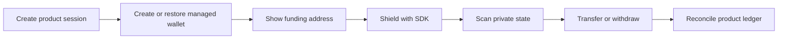

Arcane gives your application SDK and infrastructure primitives for private transactions. Your product keeps its own normal objects, such as card loads, payroll batches, treasury movements, customers, and ledger entries.

Do not model your backend around invented Arcane-hosted objects. Start with your product flow, then call the SDK, indexer, relayer, and chain RPC where the flow needs privacy-layer execution.

## Core model

Most backend-managed integrations follow the same lifecycle:

The partner application owns the product experience and product records. Arcane provides privacy-layer transaction machinery.

| Layer | Responsibility |
| --- | --- |
| Partner frontend | Shows product actions, funding instructions, progress, and final product result |
| Partner backend | Authenticates users, owns product sessions, stores wallet state, calls the SDK, and reconciles outcomes |
| Arcane SDK | Builds private transaction inputs, proofs, encrypted outputs, and relayer submissions |
| Arcane indexer and relayer | Provide Merkle/indexer data and transaction submission |
| Chain RPC | Confirms public funding, private pool execution, and public withdrawals |

## Backend state

Keep the backend state close to the current SDK integration guide.

| State | Owner | Purpose |
| --- | --- | --- |
| Product record | Partner | Card load, payroll batch, payout, treasury operation, or customer action |
| Managed wallet row | Partner | Owner wallet, managed signer, proof signature, and deposit index |
| UTXO scan cache | Partner | Scan progress, decoded UTXOs, encrypted outputs, and spendable state |
| Operation history | Partner | Deposit, shield, transfer, withdrawal, retry, and failure records |
| Transaction signatures | Partner and chain | Public evidence for support, reconciliation, and status tracking |

Arcane does not need to become the system of record for your business objects. Store stable product references in your backend and attach SDK/chain outputs to those records.

## Integration styles

| Style | Use when | Where secrets live |
| --- | --- | --- |
| Backend-managed wallet | You need server-side orchestration, card funding, payroll execution, or reliable reconciliation | Partner backend, KMS, HSM, or managed signing service |
| Client-side wallet flow | End users should sign privacy-layer actions directly | End-user wallet and browser session |
| Hybrid flow | A wallet-authenticated user action should authorize backend execution | Wallet signs authorization; backend executes and reconciles |

Start with the backend-managed model for card funding, payroll funding, treasury settlement, or any flow where your backend must finish the operation after the user leaves the page.

## What users see

Users should not see commitments, nullifiers, Merkle roots, proof files, or relayer jobs. They should see product language:

- "Add funds"
- "Processing"
- "Available"
- "Transfer"
- "Withdraw"
- "Failed"

The integration should feel like a normal transaction flow. Arcane-specific details stay in backend logs, support tools, and developer tooling.

## Read next

<Columns cols={2}>
  <Card title="Build your first private transaction" icon="route" href="/get-started/first-private-transaction">
    Create a first end-to-end transaction using the current SDK-backed flow.
  </Card>
  <Card title="Backend-managed wallets" icon="server" href="/sdks/backend-managed-wallets">
    Use the server-side pattern for card, payroll, and treasury flows.
  </Card>
</Columns>
