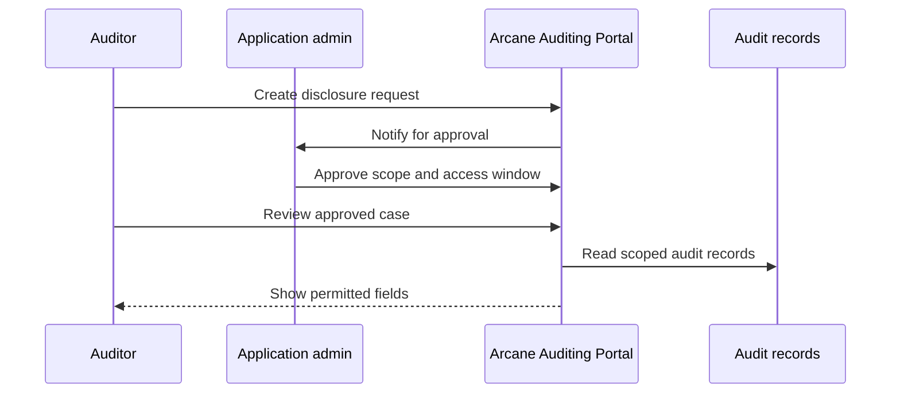

Controlled disclosure means private transaction data is not broadly visible by default.

Authorized users request, approve, review, and report only the scoped data they are allowed to see.

## Disclosure flow

## Scope dimensions

| Dimension | Examples |
| --- | --- |
| Organization | Which partner or customer organization owns the data |
| Application | Which application owns the product flow |
| Time window | Start and end time for permitted review |
| Asset | SOL or supported private asset |
| Operation references | Product object ids, transaction signatures, disclosure cases, and reports |
| Role | Auditor, application administrator, organization administrator |
| Case | Specific investigation, dispute, report, or legal request |

## Integration requirements

Your backend should:

- Store product references and transaction signatures for each relevant product action.
- Keep product references stable and searchable.
- Preserve status history.
- Route sensitive review through the Auditing Portal or an equivalent scoped workflow.
- Log access, report generation, and downloads.

## Related pages

<Columns cols={2}>
  <Card title="Reconciliation and support" icon="file-search" href="/integration-guides/reconciliation-and-support">
    Link product records to SDK and chain evidence.
  </Card>
  <Card title="Identity and access" icon="lock-keyhole" href="/auditing-portal/identity-and-access">
    Understand how portal access is scoped and enforced.
  </Card>
</Columns>
