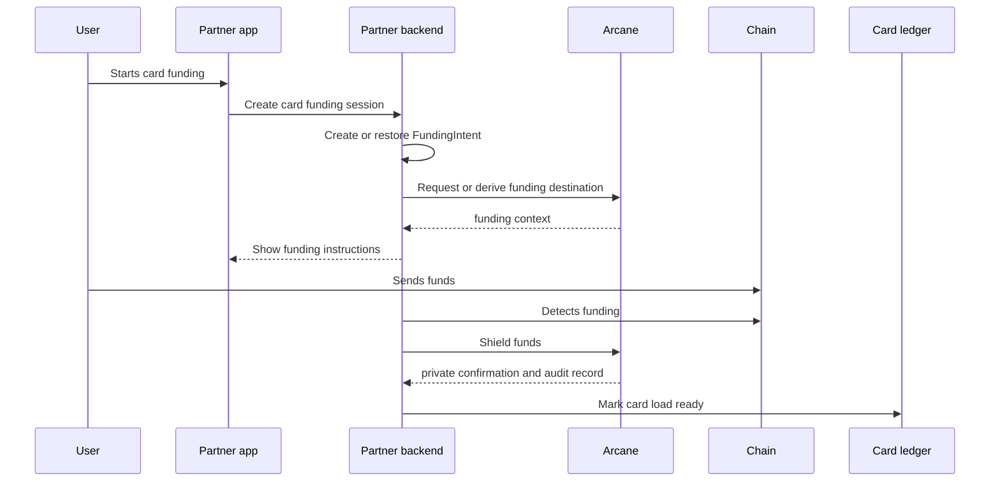

Private card funding lets a user or partner system add funds to a card program while reducing public transaction visibility. Your application keeps the internal mapping between the customer, card, funding intent, and treasury operation. External observers should not be able to reconstruct the product-level card funding flow from public chain activity alone.

## When to use this guide

Use this pattern when you operate:

- Consumer or business card programs.
- Stablecoin-backed card funding.
- Embedded finance accounts with card spend.
- Contractor or employee cards connected to payroll or treasury balances.
- White-label card programs where you need partner-level reconciliation.

## High-level flow



## Partner responsibilities

Your backend owns the product state.

| Data | Owner |
| --- | --- |
| Customer id | Partner |
| Card id or card-load id | Partner |
| Funding amount and asset | Partner |
| Funding intent id | Partner backend; Arcane too when hosted API is enabled |
| Private transaction id | Arcane and partner |
| Audit record id | Arcane and partner when audit records are enabled |
| Card ledger update | Partner |

Keep partner ids in `external_reference` and metadata. Do not put customer personal data in public chain metadata or low-level transaction fields.

## Step 1: Create a card funding session

When the customer chooses to fund a card, create a card funding session in your backend.

```json
{
  "card_load_id": "card_load_123",
  "customer_reference": "customer_456",
  "amount": "100.00",
  "asset": "USDC",
  "chain": "solana"
}
```

The card funding session should be idempotent. If the user refreshes the page, return the same open session instead of creating duplicate funding instructions.

## Step 2: Create a funding intent

Create a `FundingIntent` for the card funding session. In the current SDK path, this is usually a partner-backend resource that records the product intent and drives SDK calls. If hosted API access is enabled for your environment, Arcane may create and store the hosted `FundingIntent`.

```json
{
  "private_account_id": "pa_...",
  "amount": "100.00",
  "asset": "USDC",
  "chain": "solana",
  "external_reference": "card_load_123",
  "metadata": {
    "use_case": "private_card_funding",
    "customer_reference": "customer_456"
  }
}
```

Return only user-safe information to the frontend:

- Amount.
- Asset.
- Funding address or wallet action.
- Expiration time.
- Current status.

## Step 3: Detect funds and shield

After public funds arrive, shield them into the private account.

In a backend-managed Solana integration, this maps to:

- Scan or confirm the public funding transaction.
- Call the SDK deposit path.
- Submit through the relayer.
- Wait for confirmation.
- Scan private state until balance is available.

See [Backend-Managed Wallets](/sdks/backend-managed-wallets) and [Solana SDK](/sdks/solana-sdk).

## Step 4: Complete the card load

After Arcane marks the private balance as available, update your card ledger or treasury operation.

| State | Product action |
| --- | --- |
| `available` | Mark card load ready or initiate card ledger funding |
| `failed` | Retry shielding or route to operations review |
| `expired` | Close the funding session and ask the user to start again |
| `requires_review` | Hold the card load until support or compliance review finishes |

Do not mark the card load as complete before you have both chain confirmation and Arcane indexed state.

## Step 5: Reconcile and audit

Store enough data to answer support, dispute, fraud, and compliance questions.

| Record | Why it matters |
| --- | --- |
| Card-load id | Links the product action to Arcane state |
| Funding intent id | Tracks the public funding to private shielding path |
| Private transaction id | Links private movement and balance update |
| Audit record id | Supports permissioned disclosure |
| Status history | Explains delays, retries, and operational events |

The customer-facing UI can stay simple. Internal operations and authorized auditors can use the audit record when they have the correct scope.

## Failure handling

| Failure | Recommended handling |
| --- | --- |
| Funds arrived after expiration | Resume or create a new intent through support tooling |
| Amount mismatch | Hold the session and show manual review status |
| Shielding failed | Retry with idempotency key and preserve the same card-load reference |
| Indexer lag | Keep the user in processing status and poll or wait for webhook when available |
| Card ledger update failed | Keep Arcane state available and retry the product ledger update |

## Go-live checklist

- Funding sessions are idempotent.
- Public funding detection handles partial and late transfers.
- Card loads are not completed before private state is indexed.
- Customer ids are not leaked into public chain metadata.
- Operations can find the Arcane audit record from the card-load id.
- Compliance can request scoped disclosure without broad database access.
