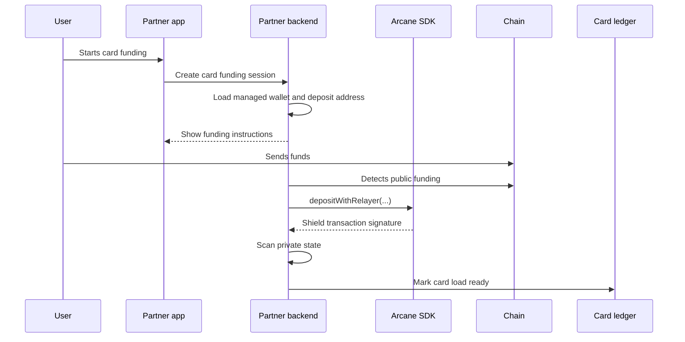

Private card funding lets a user or partner system add funds to a card program while reducing public transaction visibility. Your application keeps the internal mapping between the customer, card-load record, funding address, chain transaction, and treasury operation.

## When to use this guide

Use this pattern when you operate:

- Consumer or business card programs.
- Stablecoin-backed card funding.
- Embedded finance accounts with card spend.
- Contractor or employee cards connected to payroll or treasury balances.
- White-label card programs where you need partner-level reconciliation.

## High-level flow



## Partner responsibilities

Your backend owns the product state.

| Data | Owner |
| --- | --- |
| Customer id | Partner |
| Card id or card-load id | Partner |
| Funding amount and asset | Partner |
| Funding address shown to user | Partner backend, derived from managed wallet state |
| Public funding transaction | Chain and partner |
| Shield transaction signature | Chain, relayer, and partner |
| Card ledger update | Partner |

Keep partner ids in your backend. Do not put customer personal data in public chain metadata or low-level transaction fields.

## Step 1: Create a card funding session

When the customer chooses to fund a card, create a card funding session in your backend.

```json
{
  "card_load_id": "card_load_123",
  "customer_reference": "customer_456",
  "amount": "100.00",
  "asset": "USDC",
  "chain": "solana",
  "status": "awaiting_public_funds"
}
```

The card funding session should be idempotent. If the user refreshes the page, return the same open session instead of creating duplicate funding instructions.

## Step 2: Show funding instructions

Load or create the backend-managed wallet context for the customer or funding profile. Return only user-safe information to the frontend:

- Amount.
- Asset.
- Funding address or wallet action.
- Expiration time.
- Current product status.

Do not expose managed private keys, proof signatures, decoded UTXOs, or encrypted output caches.

## Step 3: Detect funds and shield

After public funds arrive, shield them into private state.

In a backend-managed Solana integration, this maps to:

- Confirm the public funding transaction through Solana RPC.
- Call the SDK deposit path, usually `depositWithRelayer`.
- Submit through the relayer.
- Store the returned signature and operation history.
- Scan private state until the balance is available.

See [Backend-Managed Wallets](/sdks/backend-managed-wallets) and [Solana SDK](/sdks/solana-sdk).

## Step 4: Complete the card load

After the shield transaction is confirmed and indexed, update your card ledger or treasury operation.

| State | Product action |
| --- | --- |
| `available` | Mark card load ready or initiate card ledger funding |
| `failed` | Retry shielding or route to operations review |
| `expired` | Close the funding session and ask the user to start again |
| `requires_review` | Hold the card load until support or compliance review finishes |

Do not mark the card load as complete before you have both chain confirmation and indexed private state.

## Step 5: Reconcile

Store enough data to answer support, dispute, fraud, and compliance questions.

| Record | Why it matters |
| --- | --- |
| Card-load id | Links the product action to funding and shield operations |
| Funding address | Explains where the user sent public funds |
| Public funding signature | Confirms the public deposit |
| Shield signature | Links the SDK operation to chain execution |
| Scan state and status history | Explains delays, retries, and operational events |

The customer-facing UI can stay simple. Internal operations can use the product record and transaction signatures to investigate issues.

## Failure handling

| Failure | Recommended handling |
| --- | --- |
| Funds arrived after expiration | Resume the existing session or create a new one through support tooling |
| Amount mismatch | Hold the session and show manual review status |
| Shielding failed | Retry with the same card-load reference after confirming prior transaction state |
| Indexer lag | Keep the user in processing status and poll the indexer |
| Card ledger update failed | Keep private state available and retry the product ledger update |

## Go-live checklist

- Funding sessions are idempotent.
- Public funding detection handles partial and late transfers.
- Card loads are not completed before private state is indexed.
- Customer ids are not leaked into public chain metadata.
- Operations can find public and shield signatures from the card-load id.
- Compliance and support review is scoped to the relevant product records.
