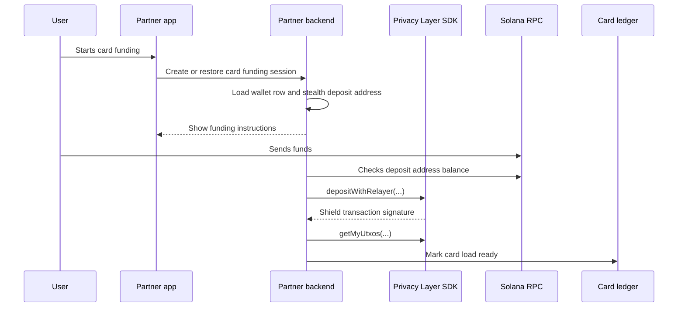

Private card funding is a product recipe on top of [Private Payments Integration Guide](/integration-guides/private-payments-integration-guide).

Your backend keeps the card funding session, customer reference, funding amount, transaction signatures, scan state, and card ledger status. Arcane provides the SDK and infrastructure for private transaction execution.

## Flow



## Partner-owned record

Create a card funding session in your backend.

```json
{
  "card_load_id": "card_load_123",
  "customer_reference": "customer_456",
  "amount": "100.00",
  "asset": "SOL",
  "chain": "solana",
  "status": "awaiting_public_funds"
}
```

This record is your product state. It is not an Arcane SDK object.

## Step 1: Create or restore wallet state

Use the same wallet row and scan state described in [Private Payments Integration Guide](/integration-guides/private-payments-integration-guide).

Return only user-safe information to the frontend:

- Amount.
- Asset.
- Funding address.
- Expiration time if your product uses one.
- Current product status.

Do not expose managed private keys, proof signatures, decoded UTXOs, or encrypted output caches.

## Step 2: Detect funds and shield

After funds arrive at the stealth deposit address:

1. Confirm the public balance through Solana RPC.
2. Call `depositWithRelayer`.
3. Store the returned signature and operation timing metadata.
4. Scan private state with `getMyUtxos`.
5. Mark private balance available only after chain confirmation and indexed state.

## Step 3: Complete card funding

Update your card ledger only after private state is available.

| State | Product action |
| --- | --- |
| `awaiting_public_funds` | Show funding instructions |
| `shielding` | Funds were detected and SDK shielding is in progress |
| `available` | Private state is indexed and the card ledger can be updated |
| `failed` | Retry or route to review |
| `expired` | Close the session or ask the user to start again |

## Reconciliation data

Store enough data to answer support, dispute, fraud, and compliance questions.

| Record | Why it matters |
| --- | --- |
| Card funding session id | Links the product action to funding and shielding |
| Funding address | Shows where the user sent funds |
| Public funding signature | Confirms public deposit when available |
| Shield signature | Links the SDK operation to chain execution |
| Scan state and status history | Explains delays, retries, and available balance |

## Failure handling

| Failure | Recommended handling |
| --- | --- |
| Funds arrived after expiration | Resume the existing session or route to review |
| Amount mismatch | Hold the session for review |
| Shielding failed | Retry with the same card funding session id after checking prior transaction state |
| Indexer lag | Keep the user in processing status and poll before marking funds available |
| Card ledger update failed | Keep private state available and retry the ledger update idempotently |

## Related pages

<Columns cols={2}>
  <Card title="Reconciliation and support" icon="file-search" href="/integration-guides/reconciliation-and-support">
    Decide what to store for operations and support.
  </Card>
  <Card title="Production checklist" icon="list-checks" href="/operations/production-checklist">
    Review readiness before launch.
  </Card>
</Columns>
