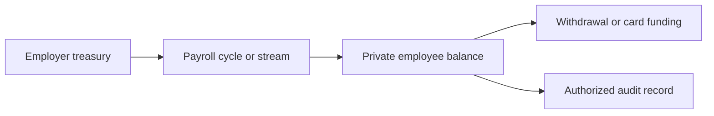

Private payroll flows let an employer or payroll platform move compensation with less public transaction leakage while preserving an authorized review path.

Use this pattern for payroll streaming, contractor payouts, earned wage access, employee withdrawals, and payroll-funded cards.

## Payroll model



## Core resources

| Resource | Payroll meaning |
| --- | --- |
| `PrivateAccount` | Employee, contractor, employer treasury, or payroll program scope |
| `FundingIntent` | Employer deposit into private payroll liquidity |
| `PrivateTransfer` | Private movement from employer or payroll pool to employee |
| `Withdrawal` | Employee payout to a public wallet, bank-linked rail, or treasury settlement path |
| `AuditRecord` | Scoped evidence for disputes, payroll records, taxes, or compliance |

## Employer funding

The employer or payroll platform first funds a private treasury account.

1. Create or retrieve the employer treasury `PrivateAccount`.
2. Create a `FundingIntent` for the payroll cycle.
3. Detect public funding.
4. Shield funds into private payroll liquidity.
5. Record the payroll cycle id in `external_reference`.

## Employee allocation

When employees accrue wages, create private transfers from the payroll pool to employee private accounts.

```json
{
  "from_private_account_id": "pa_employer_...",
  "to_private_account_id": "pa_employee_...",
  "amount": "250.00",
  "asset": "USDC",
  "external_reference": "payroll_cycle_2026_06_employee_123"
}
```

Your product can expose this as streaming or accrued compensation. Arcane only needs the private movement and reconciliation reference.

## Employee withdrawal

Employees can move available private balance to:

- A public wallet.
- A card funding flow.
- A treasury-managed payout flow.
- Another private account.

Use [Withdrawals and Payouts](/integration-guides/withdrawals-and-payouts) for public payout flows and [Private Card Funding](/integration-guides/private-card-funding) for card-linked flows.

## Audit path

Payroll privacy should not remove the ability to resolve regulated or operational questions.

Use audit records to support:

- Employee disputes.
- Employer payroll reconciliation.
- Tax and accounting review.
- Legal or regulatory disclosure.
- Internal fraud and support investigations.

Disclosure should be scoped by organization, application, case, time window, asset, and transaction references. See [Controlled Disclosure](/integration-guides/controlled-disclosure).

## Integration checklist

- Define whether each employee has one private account or one account per payroll program.
- Store payroll cycle, employee, and employer references in your backend.
- Use idempotent private transfers for recurring payroll events.
- Keep private transaction status separate from payroll product status.
- Decide how card funding and public withdrawals consume private payroll balance.
- Test audit access before moving production payroll data.
