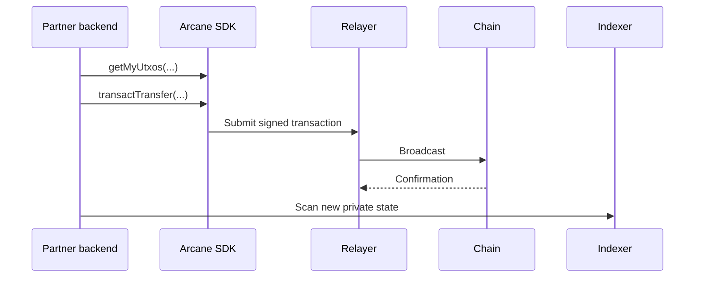

Use private transfers when value should move inside the privacy layer without exposing sender, recipient, amount, or product context as public chain-level data.

## Transfer types

| Type | Use when |
| --- | --- |
| Wallet-to-wallet | Both sender and recipient are managed by your application |
| Wallet-to-recipient | The sender knows a recipient private key or derived private recipient address |
| Treasury-to-user | A platform treasury allocates funds to users, employees, or contractors |
| User-to-treasury | A user pays a merchant, card program, or application treasury privately |

## Basic flow

1. Scan the sender's private state.
2. Confirm enough spendable UTXOs exist.
3. Resolve the recipient UTXO public key and X25519 public key.
4. Call the SDK private transfer path.
5. Store the returned transaction signature and status history.
6. Scan again after confirmation and indexing.



## Operation record

Store private transfer operations in your backend using your own product references.

```json
{
  "product_reference": "order_123",
  "sender_wallet_reference": "treasury_wallet",
  "recipient_reference": "customer_456",
  "amount": "25.00",
  "asset": "USDC",
  "operation": "transfer"
}
```

This is not an Arcane request shape. It is the kind of product record your backend can use to drive SDK calls and reconciliation.

## Status handling

Treat the transfer as asynchronous. A submitted private transfer is not final until the chain confirms it and your backend scan sees the resulting private state.

| Status | Meaning |
| --- | --- |
| `requires_balance` | The sender does not have enough available private balance |
| `preparing` | Inputs, outputs, proof, or transaction data are being prepared |
| `submitted` | The transaction was submitted |
| `confirmed` | The chain confirmed the transaction |
| `indexed` | The indexer reflects the new private state |
| `available` | Recipient balance is usable |
| `failed` | Retry or operations review is required |

## Product guidance

- Use product references, not raw protocol ids, in your customer-facing UI.
- Make transfer operations idempotent in your backend.
- Separate `submitted` from `available` in your backend state machine.
- Keep enough history to reconcile customer support and compliance questions.
- Do not expose decoded UTXOs, nullifiers, private keys, or proof inputs to the browser.
