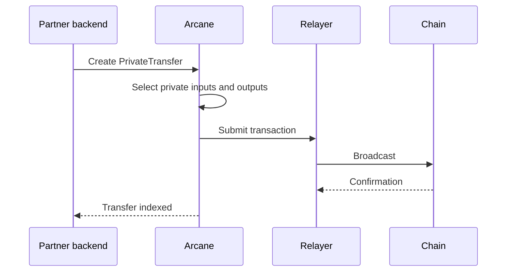

Use private transfers when value should move inside the privacy layer without exposing sender, recipient, amount, or product context as public chain-level data.

## Transfer types

| Type | Use when |
| --- | --- |
| Account-to-account | Both sender and recipient are known private accounts in your application |
| Account-to-recipient | The sender knows a recipient private address or derived private recipient key |
| Treasury-to-user | A platform treasury allocates funds to users, employees, or contractors |
| User-to-treasury | A user pays a merchant, card program, or application treasury privately |

## Basic flow

1. Confirm the sender has available private balance.
2. Resolve the recipient private account or private recipient key.
3. Create a `PrivateTransfer`.
4. Submit the transfer through the SDK or API.
5. Track status until indexed.
6. Store the audit record id for permissioned review.



## Request shape

```json
{
  "from_private_account_id": "pa_...",
  "to_private_account_id": "pa_...",
  "amount": "25.00",
  "asset": "USDC",
  "external_reference": "order_123",
  "metadata": {
    "use_case": "private_transfer"
  }
}
```

## Status handling

Treat the transfer as asynchronous. A submitted private transfer is not final until Arcane indexes the resulting private state.

| Status | Meaning |
| --- | --- |
| `requires_balance` | The sender does not have enough available private balance |
| `preparing` | Inputs, outputs, proof, or transaction data are being prepared |
| `submitted` | The transaction was submitted |
| `confirmed` | The chain confirmed the transaction |
| `indexed` | Arcane indexed the new private state |
| `available` | Recipient balance is usable |
| `failed` | Retry or operations review is required |

## Product guidance

- Use product references, not raw protocol ids, in your customer-facing UI.
- Keep transfer creation idempotent.
- Separate "submitted" from "available" in your backend state machine.
- Keep enough history to reconcile customer support and compliance questions.
- Do not expose decoded UTXOs, nullifiers, private keys, or proof inputs to the browser.
