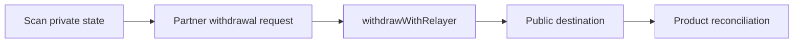

Withdrawals move value from Arcane private state to a public destination. Use them for user withdrawals, treasury settlement, payroll payouts, and liquidity movements.

## Withdrawal flow



## Create a withdrawal request

Your backend should create its own withdrawal or payout record before calling the SDK.

```json
{
  "withdrawal_reference": "withdrawal_123",
  "wallet_reference": "customer_456",
  "amount": "50.00",
  "asset": "USDC",
  "chain": "solana",
  "destination_address": "...",
  "status": "preparing"
}
```

For Solana, the SDK call maps to `withdrawWithRelayer`.

## Backend checks

Before submission:

- Confirm the user or product action is authorized.
- Validate the destination address format.
- Scan private state and confirm spendable balance.
- Apply compliance, velocity, and product controls.
- Make the withdrawal request idempotent.

## Status lifecycle

| Status | Meaning |
| --- | --- |
| `requires_balance` | Private balance is insufficient |
| `requires_review` | Product or compliance policy requires review |
| `preparing` | Proof and transaction data are being prepared |
| `submitted` | Transaction was submitted |
| `confirmed` | Public chain confirmed the withdrawal |
| `indexed` | Private spend is visible to the indexer |
| `paid_out` | Your product has marked the payout complete |
| `failed` | Retry or review is required |

## Reconciliation

Store:

- Withdrawal reference.
- Destination address.
- Public transaction signature or hash.
- Managed wallet reference.
- Product reference.
- Status history.
- Retry attempts and errors.

For payroll and card products, keep the product ledger update separate from the withdrawal transaction status. This prevents double accounting when a chain transaction succeeds but a downstream ledger update needs retry.

## Production notes

- Never let the browser provide unrestricted withdrawal parameters.
- Use idempotency keys for withdrawal creation and retries.
- Treat relayer, chain RPC, and indexer failures as independent retry domains.
- Keep support and disclosure access scoped and logged.
- Consider manual review for large, unusual, or compliance-sensitive withdrawals.
