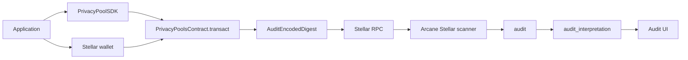

This guide describes the Stellar/Soroban privacy-pool integration path: an application submits `transact` calls to the Soroban contract, and Arcane indexes the registered contract events for disclosure workflows.

## Integration model



## Prerequisites

You need:

- A Stellar/Soroban network and RPC endpoint.
- A deployed `PrivacyPoolsContract`.
- Contract verification key and public slot configuration matching the circuit.
- Contract decoding key for audit interpretation.
- `@auditable/privacy-pool-zk-sdk` available to the application.
- A Stellar wallet integration.
- An Arcane organization and application record.
- Backend chain, contract, asset, and application registry rows.
- Scanner environment configured for the Stellar chain.

Architecture references:

- [Privacy Pools overview](/privacy-pools/overview)
- [Soroban Contract](/privacy-pools/soroban-contract)
- [Indexing and Interpretation](/auditing-portal/indexing-and-interpretation)
- [Identity and Access](/auditing-portal/identity-and-access)

## Contract setup

Deploy `PrivacyPoolsContract` with:

| Constructor argument | Purpose |
| --- | --- |
| `tree_depth` | Commitment tree depth |
| `vk_bytes` | Groth16 verification key bytes |
| `public_n_inputs` | Public withdrawal slot count |
| `public_n_outputs` | Public deposit slot count |
| `admin` | Contract admin address |

The deployed contract exposes `transact`, public getters, and the `AuditEncodedDigest` event.

## Application setup

The application integrates the SDK and wallet.

Application steps:

1. Initialize `PrivacyPoolSDK`.
2. Derive a user stealth address from a Stellar wallet signature when the user receives private funds.
3. Read pool state needed for witness construction.
4. Build coin and transaction inputs.
5. Generate proof and public signals with `proveTransaction` or a higher-level SDK helper such as `proveWithdrawal`.
6. Prepare encrypted audit bytes for the `encoded` argument.
7. Ask the wallet to sign and submit `PrivacyPoolsContract.transact`.

`deposit`, `withdraw`, and `transfer` are user-facing transaction shapes. The current contract call remains `transact`.

## Soroban call shape

The application submits:

```text
transact(from, proof_bytes, pub_signals_bytes, encoded)
```

| Argument | Source |
| --- | --- |
| `from` | Wallet-authenticated Stellar address |
| `proof_bytes` | SDK-serialized Groth16 proof |
| `pub_signals_bytes` | SDK-serialized public signals |
| `encoded` | Encrypted audit payload bytes |

After successful proof verification and state update, the contract emits:

```text
AuditEncodedDigest(message_name = "transact", digest = encoded)
```

## Arcane registry setup

Arcane indexes only registered contracts.

Required backend registry data:

| Table | Required data |
| --- | --- |
| `chain` | Stellar chain name, `type = stellar`, RPC URL, optional network passphrase, optional initial ledger hint |
| `contracts` | Soroban contract address, `chain_id`, `decoding_key`, optional `encoding_key` |
| `assets` | Asset metadata and Stellar asset contract references |
| `asset_pool_contracts` | Links assets to pool contracts |
| `applications` | Organization application with `foreign_id`, `application_type = stellar-pool`, and `association.contract_id` |
| `team_member_application_permissions` | Admin/auditor permission buckets for application users |

The backend initialization flow can seed organizations, team metadata, chains, contracts, assets, applications, and permissions from configured environment and seed files.

## Scanner setup

Configure the backend Stellar scanner with:

| Configuration | Purpose |
| --- | --- |
| Stellar RPC URL | Ledger and event source |
| Stellar chain name | Matches `chain.name` |
| Stellar network passphrase | Used when parsing transaction metadata |
| Initial ledger | Starting point before a checkpoint exists |
| Ledgers per request | Scanner batch size |
| Scanner chain list | Registers Stellar scanner providers |

The scanner writes:

- `stellar_scans` checkpoint rows.
- `audit` raw event rows.
- `audit_chain` links.

## Interpretation setup

For Stellar rows, interpretation requires `contracts.decoding_key`.

The worker:

1. Locks uninterpreted `audit` rows.
2. Parses `public_signals_json`.
3. Decrypts `cyphertext` with `decoding_key`.
4. Plans normalized `deposit`, `withdraw`, or `transfer` rows.
5. Writes `audit_interpretation`.
6. Stores `interpretation_error` if processing fails.

Interpreted rows are still backend data. Auditor visibility requires case scope and permissions.

## Access setup

Application users need:

| Access area | Backend source |
| --- | --- |
| Organization session | Identity provider session and `organisations` row |
| Owner permissions | `team_member_meta.permissions` / owner resolution |
| Application permissions | `team_member_application_permissions` arrays |
| Application route segment | `applications.foreign_id` |
| Case access | `case_auditor_assignments` plus active access window |

The UI route for application workspaces is `/workspace/application/:foreignId`.

## Verification checklist

Use this checklist for an end-to-end Stellar privacy-pool integration:

- Contract is deployed with the expected tree depth, verification key, and public slot counts.
- Application can initialize `PrivacyPoolSDK`.
- Application can derive or import a `stpl1` stealth address.
- Application can generate proof bytes and public signal bytes.
- Wallet can submit `transact`.
- Contract stores commitments/nullifiers/roots as expected.
- Contract emits `AuditEncodedDigest`.
- `chain` and `contracts` rows exist for the Stellar deployment.
- `applications` row exists with `application_type = stellar-pool` and `association.contract_id`.
- Scanner advances `stellar_scans`.
- Scanner writes `audit` rows with `event_type = transact`.
- Interpretation writes `audit_interpretation` rows.
- `GET /auth/me` returns the expected `applications[foreignId]` permissions.
- Auditor can create a case request.
- Administrator can approve or close the request.
- Assigned auditor can open the approved case and see only scoped fields.
- Report generation and download work with separate permissions.
- `auditors_log` records request, decision, access, report, and download events.

## Troubleshooting

| Symptom | Check |
| --- | --- |
| No audit rows | Contract registered to the correct `chain_id`, scanner chain name configured, checkpoint range covers event ledger |
| Scanner runs but ignores event | Event is from a successful contract call and event topic maps to a supported audit type |
| Duplicate-looking scan | `audit` upsert is idempotent by `(contract_id, soroban_event_id)` |
| Public signals missing or wrong | Scanner calldata parser can read the `transact` invocation metadata |
| Interpretation fails | `contracts.decoding_key`, `audit.cyphertext`, and `audit.public_signals_json` |
| UI route 404 or empty | `applications.foreign_id` matches `/workspace/application/:foreignId` |
| User sees workspace but not route | Required permission key is absent from the relevant application bucket |
| Auditor cannot open case | Case assignment, approval status, application scope, and access window |
| Report generation succeeds but download fails | `reports:create` and `reports:download` are separate permissions |
