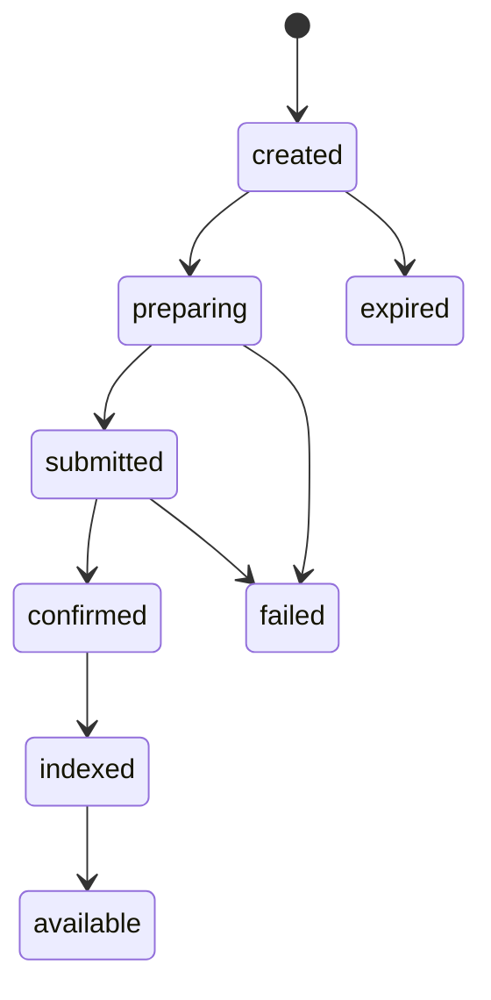

Arcane operations are asynchronous. Your backend should track each resource until the chain transaction is confirmed, Arcane indexes private state, and your product ledger is updated.

## Common lifecycle



## Status meanings

| Status | Meaning |
| --- | --- |
| `created` | Resource exists but work has not started |
| `requires_funding` | Funding intent waits for public funds |
| `funding_detected` | Public funding was observed |
| `preparing` | Arcane is preparing inputs, proof, or transaction data |
| `shielding` | Public funds are being moved into private state |
| `submitted` | A transaction or relayer job was submitted |
| `confirmed` | The chain confirmed the transaction |
| `indexed` | Arcane indexed the resulting private state |
| `available` | Balance or resource outcome is ready for product use |
| `paid_out` | Partner product marked a withdrawal or payout complete |
| `failed` | Retry or operations review is required |
| `expired` | The action timed out before completion |

## Product rule

Only mark a money movement complete after your product-specific completion condition is true.

For example:

- Card funding is complete after private state is available and your card ledger update succeeds.
- Payroll transfer is complete after private state is indexed and your payroll ledger records the allocation.
- Withdrawal is complete after public chain confirmation and your payout ledger update succeeds.

## Store status history

Keep an append-only history where possible.

```json
{
  "resource_id": "fi_...",
  "from_status": "confirmed",
  "to_status": "indexed",
  "created_at": "2026-06-25T10:00:00Z"
}
```

Status history is important for support, reconciliation, and audit review.
