The contract emits one audit event after a successful `transact` execution. This event is the boundary consumed by the off-chain scanner.

## Event shape

```rust
#[contractevent(topics = ["audit", "encoded_digest"], data_format = "single-value")]
pub struct AuditEncodedDigest {
    #[topic]
    message_name: String,
    digest: Bytes,
}
```

| Field | Meaning |
| --- | --- |
| Topic `audit` | Scanner-level event category |
| Topic `encoded_digest` | Event shape marker |
| `message_name` | Currently `transact` |
| `digest` | Encrypted audit payload passed to `transact` as `encoded` |

## Event handoff

```mermaid
flowchart LR
  contract["PrivacyPoolsContract.transact"]
  event["AuditEncodedDigest"]
  rpc["Stellar RPC"]
  scanner["StellarLedgerScannerService"]
  raw["audit"]
  interpreter["AuditInterpretationRunnerService"]
  interpreted["audit_interpretation"]

  contract --> event
  event --> rpc
  rpc --> scanner
  scanner --> raw
  raw --> interpreter
  interpreter --> interpreted
```



## Scanner mapping

For the current Stellar privacy-pool contract:

| Contract event topic | Stored raw event type |
| --- | --- |
| `audit` | `transact` |

The scanner stores:

| `audit` column | Source |
| --- | --- |
| `contract_id` | Registered `contracts.id` |
| `tx_id` | Stellar transaction hash |
| `soroban_event_id` | Stellar event id |
| `event_type` | `transact` |
| `cyphertext` | `AuditEncodedDigest.digest` |
| `public_signals_json` | Parsed from event payload or `transact` calldata when available |
| `signer_account` | Resolved from invocation metadata when available |

See [Indexing and Interpretation](/auditing-portal/indexing-and-interpretation) for the off-chain processing path.
