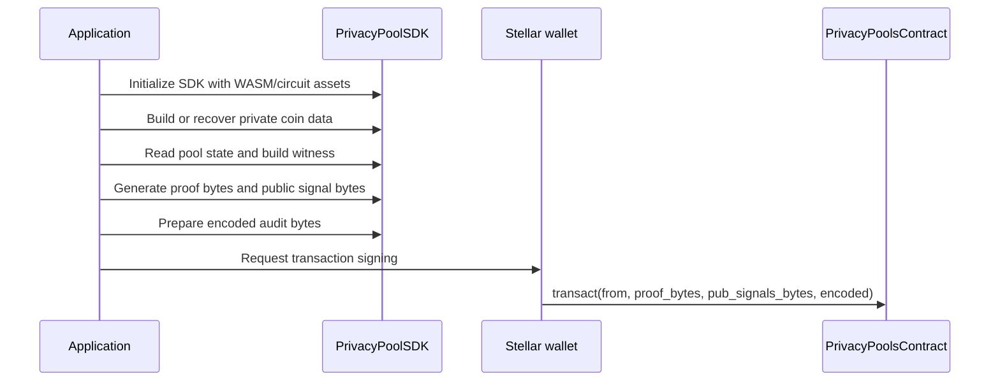

`PrivacyPoolSDK` is the client-side boundary between an application and the Soroban privacy-pool contract. It prepares the cryptographic inputs for `PrivacyPoolsContract.transact`; it does not manage disclosure cases, reports, or auditor permissions.

## Boundary

| Area | Reference or partner application | PrivacyPoolSDK | Arcane Auditing Portal |
| --- | --- | --- | --- |
| End-user UI | Yes | No | No |
| Stellar wallet connection | Yes | Uses signatures / transaction flow | No |
| Coin construction | Calls SDK | Yes | No |
| Merkle witness preparation | Calls SDK | Yes | No |
| Proof generation | Calls SDK | Yes | No |
| Soroban argument serialization | Calls SDK | Yes | No |
| Contract event indexing | No | No | Yes |
| Audit interpretation | No | No | Yes |
| Disclosure cases and reports | No | No | Yes |

## SDK responsibilities

| SDK area | Function examples |
| --- | --- |
| Stealth address derivation | `buildStealthAddressSignMessage`, `generateStealthAddressFromStellarSignature` |
| Coin creation | `generateCoin`, `generateCoinWithSharedSecret`, `generateCoinForDepositWithSharedHex` |
| Witness preparation | `buildWithdrawMerkleWitness` |
| Proof generation | `proveWithdrawal`, `proveTransaction` |
| Soroban serialization | `proofToHex`, `publicToHex` |
| Nullifier helper | `calculateNullifierHash` |
| ECDH helpers | `ecdhEphemeralPublicKeyFromScalarHex`, `ecdhSharedKey`, shared-secret helpers |

## Application flow



## Install

```bash
npm install @auditable/privacy-pool-zk-sdk
```

Runtime requirements:

- Node.js `>=19.0.0`, or
- A browser with Web Crypto (`crypto.subtle`)

## Soroban call shape

The application submits:

```text
transact(from, proof_bytes, pub_signals_bytes, encoded)
```

| Argument | Produced by |
| --- | --- |
| `from` | Wallet-authenticated Stellar address |
| `proof_bytes` | SDK proof serialization |
| `pub_signals_bytes` | SDK public-signal serialization |
| `encoded` | Encrypted audit payload prepared by the application/SDK flow |

After a successful transaction, the contract emits `AuditEncodedDigest`; the backend scanner reads it later through Stellar RPC.
