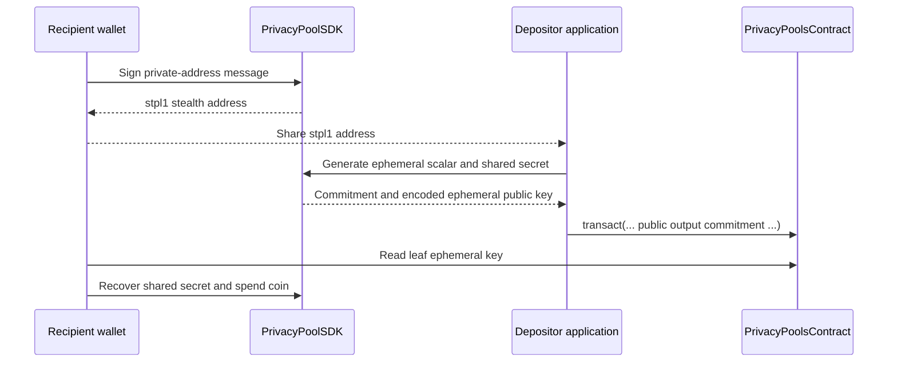

Private transfers rely on commitments, nullifiers, and ECDH-based private addresses.

<Warning>
The Poseidon hash implementation used by the circuits, contract helpers, and SDK WASM code is a prototype for research and educational purposes. It is not audited and exists to keep Circom and Rust/WASM code consistent.
</Warning>

## Cryptographic model

A private coin is represented by:

| Field | Role |
| --- | --- |
| `value` | Amount in stroops |
| `asset[0]`, `asset[1]` | Stellar asset contract id as two field limbs |
| `nullifier` | Secret spent to prevent double-spending |
| `secret` | Derived from deposit ephemeral scalar |
| `sharedSecret[0]`, `sharedSecret[1]` | ECDH key coordinates binding the coin to a recipient |
| `commitment` | Public pool leaf hash |

## Commitment generation

The `CommitmentHasher` template in `circuits/commitment.circom` defines:

```text
precommitment = Poseidon(secret, sharedSecret[0], sharedSecret[1])
balanceCommitment = Poseidon(value, asset[0], asset[1])
commitment = Poseidon(nullifier, balanceCommitment, precommitment)
```

The Rust client SDK in `client-sdk/crate/src/coin.rs` implements the same formulas for off-chain coin generation and Merkle witness construction.

## Nullifiers

- The raw `nullifier` stays private in the zero-knowledge witness.
- `nullifierHash = Poseidon(nullifier)` is public when a coin is spent.
- The Soroban contract stores nullifier hashes and rejects reuse.

Use an initialized SDK instance and `sdk.calculateNullifierHash(nullifier)` to compute the hash from a coin's decimal nullifier string.

## Stealth address flow



## Deposit-side private address flow

1. The recipient publishes a stealth private address encoded as Bech32 with HRP `stpl1`.
2. The depositor samples an ephemeral scalar (`< 2^253` bits).
3. The depositor derives an ephemeral public key and an ECDH shared secret with the recipient's public key.
4. The deposit circuit sets `secret = Poseidon(ephemeralKeyScalar)` and includes the shared secret in the commitment.
5. The ephemeral public key is stored alongside the commitment on-chain.

## Withdrawal-side recovery

1. The recipient holds their private scalar, derived from a Stellar wallet signature.
2. The recipient reads the depositor's ephemeral public key from the on-chain leaf.
3. ECDH produces the same shared secret as the deposit path.
4. The withdrawal circuit recomputes the commitment, proves Merkle inclusion, and publishes only the nullifier hash.

## Private address generation

1. Build a sign message with `PrivacyPoolSDK.buildStealthAddressSignMessage(stellarAddress)`.
2. The user signs the message with their Stellar wallet.
3. The SDK hashes the signature with SHA-256 and derives a BabyJubJub scalar.
4. The scalar maps to a public point encoded as a `stpl1` Bech32 address.

```ts
const message = PrivacyPoolSDK.buildStealthAddressSignMessage(stellarAddress);
const signature = await wallet.signMessage(message);
const sdk = await PrivacyPoolSDK.init();
const stealthAddress = await sdk.generateStealthAddressFromStellarSignature(signature);
```

## SDK assets

Browser integrations pass WASM and circuit assets to `PrivacyPoolSDK.init()`:

```ts
const sdk = await PrivacyPoolSDK.init({
  wasmBinary: await fetch("/pkg/client_sdk_wasm_bg.wasm").then((r) => r.arrayBuffer()),
  circuitWasm: await fetch("/assets/main.wasm").then((r) => r.arrayBuffer()),
  zkey: await fetch("/assets/main_final.zkey").then((r) => r.arrayBuffer()),
});
```

See [Client SDK](/privacy-pools/client-sdk) for the application integration boundary.
