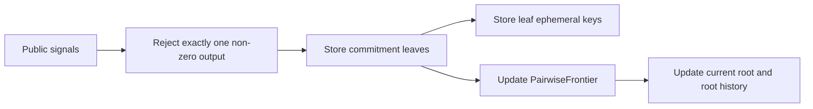

The contract stores protocol state required to verify private spends and construct future witnesses.

## State model

| State | Storage key or getter | Purpose |
| --- | --- | --- |
| Commitment leaves | `TreeDataKey::Leaf(index)`, `get_commitments` | Public commitment hashes |
| Leaf count | `TreeDataKey::LeafCount`, `get_commitment_count` | Number of stored leaves |
| Leaf ephemeral keys | `TreeDataKey::LeafEphemeral(index)`, `get_leaf_ephemeral` | Recipient-side shared-secret recovery input |
| Merkle root | `TREE_ROOT_KEY`, `get_merkle_root` | Current pool root |
| Merkle frontier | `TreeDataKey::PairwiseFrontier`, `get_pairwise_frontier` | Pairwise LeanIMT insertion state |
| Root history | `RootHistoryKey::Root(i)`, `is_known_root` | Recent roots accepted for proof verification |
| Nullifier state | `NulifierDataKey::Nulifier(hash)`, `is_nulifier_hash_consumed` | Double-spend prevention |
| Token balance | Token contract balance, `get_token_balance` | Public token balance held by the pool contract |
| Public slot config | `get_public_slot_config` | Public input/output slot counts |

## Commitment insertion

`transact` stores either zero output commitments or exactly two output commitments.



Exactly one non-zero output commitment is rejected by the current contract shape. This keeps output handling aligned with the circuit's two-output transaction model.

## Nullifier checks

When a transaction spends private inputs:

1. The circuit publishes nullifier hashes in public signals.
2. The contract checks each hash against stored nullifier state.
3. Any reused nullifier hash causes the transaction to fail.
4. After proof verification succeeds, the contract marks the nullifier hashes as consumed.

The raw nullifier remains private in the witness.

## Root history

The contract accepts proofs against recent roots rather than only the latest root. This allows transactions to be built from a recent view of pool state while new leaves are appended by other transactions.

Current implementation detail:

```text
ROOT_HISTORY_SIZE = 90
```

`is_known_root` checks whether the submitted `stateRoot` is still present in the ring buffer.

## Token legs

Public token movement is handled inside `transact`:

| Token leg | Direction |
| --- | --- |
| Public deposit | `from` -> pool contract |
| Public withdrawal | Pool contract -> public Stellar account encoded in public signals |

Private transfers between pool commitments do not expose recipient or sender account movement on-chain beyond public signals, nullifier hashes, commitments, and the encrypted audit payload.
