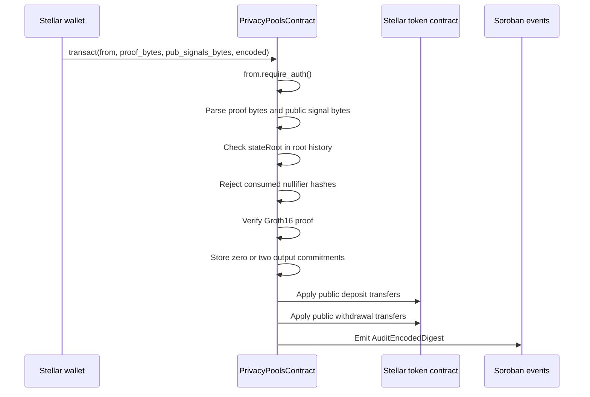

The Soroban contract is the on-chain execution boundary for the Stellar privacy pool.

## Entrypoint

The current contract exposes one public transaction entrypoint:

```rust
pub fn transact(
    env: &Env,
    from: Address,
    proof_bytes: Bytes,
    pub_signals_bytes: Bytes,
    encoded: Bytes,
) -> Result<(), Error>
```

The method handles private transfers and public token legs through proof inputs and public signals.

| Argument | Source | Meaning |
| --- | --- | --- |
| `from` | Stellar wallet | Authenticated transaction signer |
| `proof_bytes` | SDK | Serialized Groth16 proof |
| `pub_signals_bytes` | SDK | Serialized public inputs/outputs for the circuit |
| `encoded` | Application/SDK flow | Encrypted audit payload emitted by the contract |

## Execution sequence



## Contract responsibilities

- Require authentication from `from`.
- Parse Groth16 proof bytes and public signal bytes.
- Check that `stateRoot` is in recent root history.
- Read nullifier hashes from public signals and reject reused hashes.
- Verify the proof with the stored verification key.
- Store either zero output commitments or exactly two output commitments.
- Store leaf ephemeral BabyJubJub public keys next to commitment leaves.
- Update `LeafCount`, `TREE_ROOT_KEY`, `PairwiseFrontier`, and the root-history ring buffer.
- Apply public deposit transfers from `from` to the contract.
- Apply public withdrawal transfers from the contract to the public Stellar account encoded in `withdrawAddressHi` / `withdrawAddressLo`.
- Emit `AuditEncodedDigest` with `message_name = "transact"` and `digest = encoded`.

## Operation shapes

The user-facing operation names map to the single `transact` entrypoint.

| User-facing operation | `transact` representation |
| --- | --- |
| Deposit | Public deposit token leg plus one or two private output commitments |
| Withdrawal | Private input commitment spend plus public withdrawal token leg |
| Transfer | Private input commitment spend plus private output commitments |
| Mixed transaction | Combination of private input spends, private output commitments, public deposits, and public withdrawals |

## Public getters

The contract exposes getters for pool state used by applications and the SDK:

| Getter | Purpose |
| --- | --- |
| `get_merkle_root` | Current Merkle root |
| `get_merkle_depth` | Tree depth |
| `get_commitment_count` | Number of stored leaves |
| `get_commitments` | Commitment leaves |
| `get_leaf_ephemeral` | Ephemeral public key for a leaf |
| `get_pairwise_frontier` | Current pairwise frontier |
| `is_nulifier_hash_consumed` | Nullifier-consumed check |
| `is_known_root` | Root-history membership check |
| `get_token_balance` | Token balance held by the contract |
| `get_public_slot_config` | Public input/output slot configuration |
| `get_admin` | Contract admin |

## Audit event

The contract event is the handoff from the on-chain privacy pool to the off-chain audit pipeline:

```rust
#[contractevent(topics = ["audit", "encoded_digest"], data_format = "single-value")]
pub struct AuditEncodedDigest {
    #[topic]
    message_name: String,
    digest: Bytes,
}
```

The Stellar scanner maps the `audit` topic to `event_type = transact` and stores `digest` as `audit.cyphertext`.
