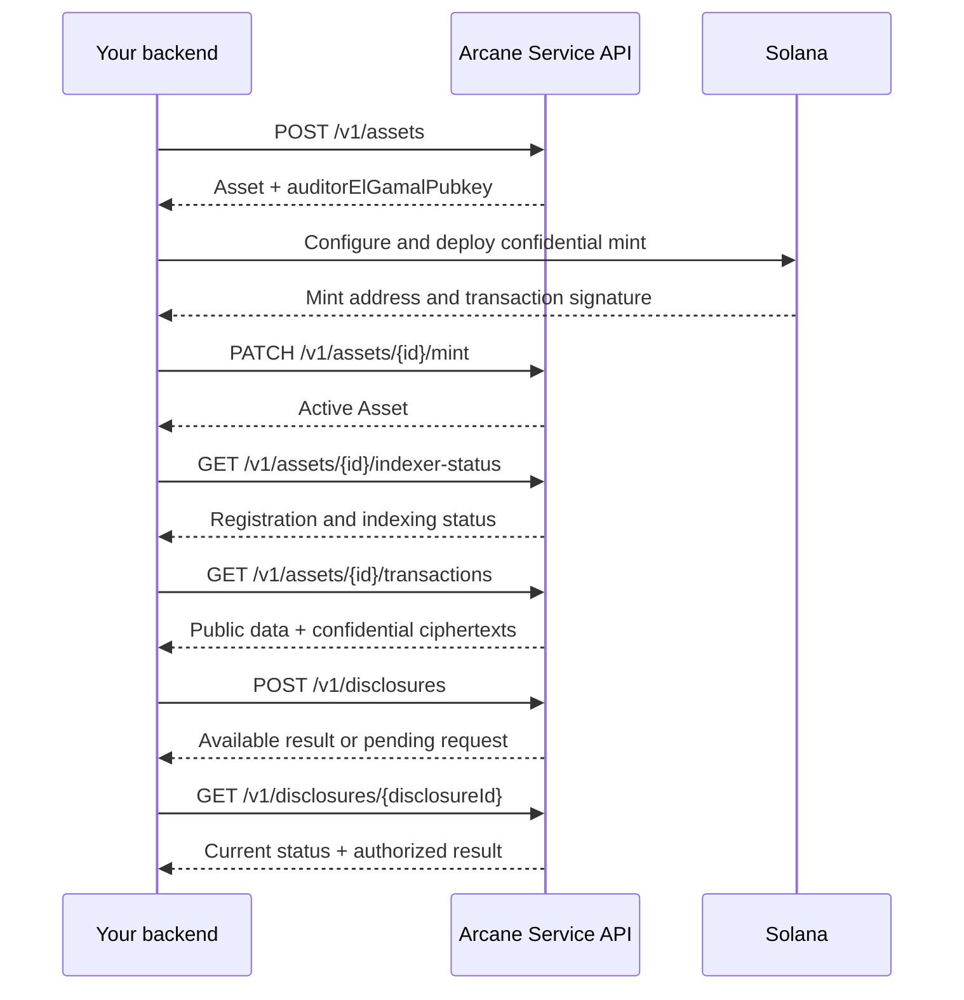

The Service API is the backend-to-backend integration used by the Solana SDP
flow. It exposes Assets, Transactions, and Disclosures under `/v1`.

Use it to:

- create an Arcane confidential Asset;
- obtain the organization's auditor ElGamal public key;
- record the deployed Solana mint;
- check whether the mint is registered and inspect indexer progress;
- retrieve indexed transactions;
- request authorized access to scoped confidential fields.

The Service API does not expose Applications, users, Cases, team management,
or API-key administration. Those resources belong to the
[User API](/products/compliance-platform/integration/api-reference/user-api/overview).

## Base URL

Arcane provides the Service API base URL during integration onboarding. It is
available upon request.

## Methods

| Method | Path | Purpose |
| --- | --- | --- |
| `POST` | `/v1/assets` | Create a confidential Asset and return its auditor public key. |
| `GET` | `/v1/assets/{id}` | Retrieve an Asset owned by the API key's organization. |
| `PATCH` | `/v1/assets/{id}/mint` | Record the deployed Solana mint and activate the Asset. |
| `GET` | `/v1/assets/{id}/indexer-status` | Read mint-registration and indexer status. |
| `GET` | `/v1/assets/{id}/transactions` | List indexed transactions for an Asset. |
| `GET` | `/v1/transactions/{transactionId}` | Retrieve one indexed transaction. |
| `POST` | `/v1/disclosures` | Request scoped access to confidential transaction fields. |
| `GET` | `/v1/disclosures/{disclosureId}` | Retrieve disclosure status and its authorized result. |

## Integration sequence

The mint-binding method records the values supplied by your backend and then
attempts to register the mint for indexing. Use the indexer-status method to
confirm registration. A successful binding response does not by itself mean
that an indexed transaction is already available.

<Columns cols={2}>
  <Card
    title="Authentication"
    icon="key-round"
    href="/products/compliance-platform/integration/api-reference/service-api/authentication"
  >
    Create and use an organization API key.
  </Card>

  <Card
    title="Asset API"
    icon="boxes"
    href="/products/compliance-platform/integration/api-reference/service-api/assets/overview"
  >
    Review the request fields, lifecycle, and four Asset methods.
  </Card>

  <Card
    title="Transaction API"
    icon="list-tree"
    href="/products/compliance-platform/integration/api-reference/service-api/transactions/overview"
  >
    Retrieve indexed public data and confidential ciphertexts.
  </Card>

  <Card
    title="Disclosure API"
    icon="scan-eye"
    href="/products/compliance-platform/integration/api-reference/service-api/disclosures/overview"
  >
    Request and retrieve authorized confidential values.
  </Card>
</Columns>
