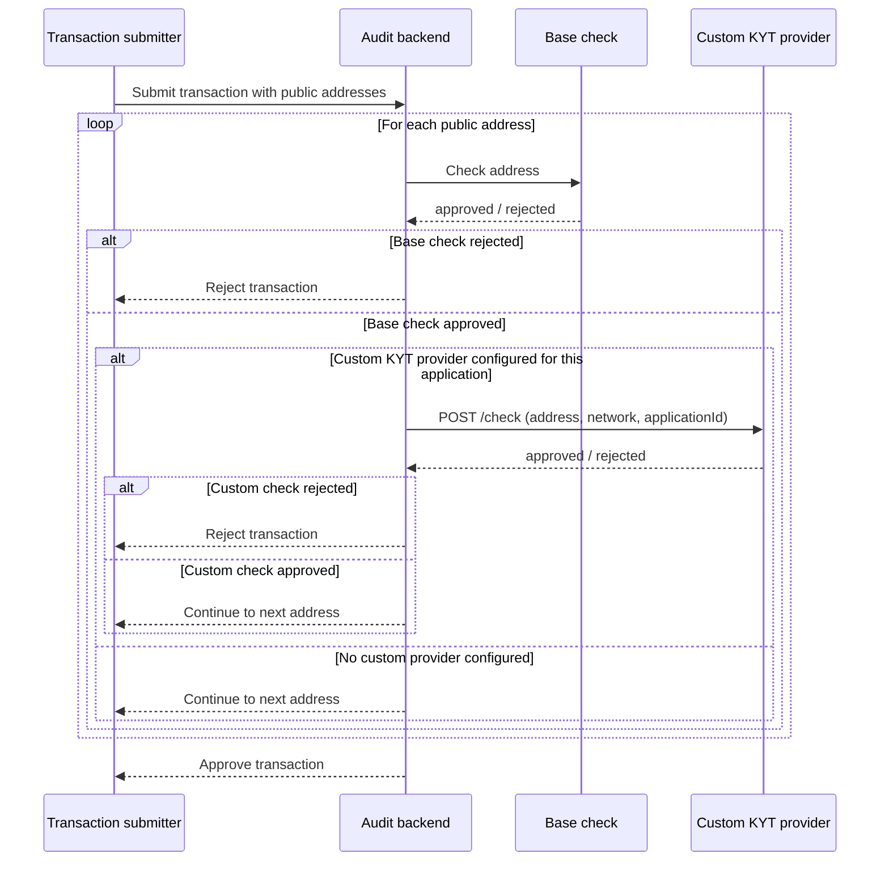

Every public address that participates in a Stellar pool transaction goes
through Know Your Transaction (KYT) screening before the transaction is
allowed to execute. Screening has two layers:

1. **Base check.** All addresses pass through Arcane's base compliance
   check. This check always runs and cannot be disabled.
2. **Custom KYT provider (optional).** An application admin can configure a
   custom KYT provider for their application. When configured, every
   address that passes the base check is also checked against the custom
   provider's own internal rules, over a webhook.

A custom KYT provider is admin-configured per application: you supply a
base URL for your KYT service, and Arcane calls it for every address in
that application's transactions. If no custom provider is configured, only
the base check applies.

## Screening flow

For each public address in a transaction, the base check always runs
first. The custom provider check (if configured) only runs after the base
check approves the address.



If every address in the transaction passes all applicable checks, the
transaction is approved.

<Warning>
  Arcane calls your custom KYT provider with strict limits: a **1 second**
  response timeout, a maximum response size of **1 GiB**, and redirects are
  not followed (any `3xx` response is treated as a failure). Your provider
  must respond within these limits, over the final URL you register — an
  address that isn't checked in time is not approved.
</Warning>

## Authorization

If you configure a shared secret for your custom KYT provider, Arcane
signs every outbound request with an HMAC-SHA256 signature so your service
can verify the request came from Arcane. Signing is opt-in: without a
shared secret, requests are sent unsigned.

The signature covers the timestamp, HTTP method, path and query string,
and raw request body, joined with `.`:

```text
{timestamp}.{METHOD}.{pathAndQuery}.{rawBody}
```

Arcane sends this as two headers on every request:

| Header | Description |
| --- | --- |
| `X-Kyt-Timestamp` | Unix timestamp in milliseconds, used in the signed string |
| `X-Kyt-Signature` | `sha256=<hex-encoded HMAC-SHA256 signature>` |

<CodeGroup>

```typescript sign-request.ts
import { createHmac } from "node:crypto";

function buildCanonicalString(parameters: {
  timestamp: string;
  method: string;
  pathAndQuery: string;
  rawBody: string;
}): string {
  return [
    parameters.timestamp,
    parameters.method.toUpperCase(),
    parameters.pathAndQuery,
    parameters.rawBody,
  ].join(".");
}

function signRequest(parameters: {
  secret: string;
  method: string;
  pathAndQuery: string;
  rawBody: string;
}): Record<string, string> {
  const timestamp = String(Date.now());
  const canonical = buildCanonicalString({ ...parameters, timestamp });
  const signature = createHmac("sha256", parameters.secret)
    .update(canonical)
    .digest("hex");
  return {
    "X-Kyt-Timestamp": timestamp,
    "X-Kyt-Signature": `sha256=${signature}`,
  };
}
```

```typescript verify-request.ts
import { createHmac, timingSafeEqual } from "node:crypto";

function verifySignature(parameters: {
  secret: string;
  timestamp: string;
  method: string;
  pathAndQuery: string;
  rawBody: string;
  signatureHeader: string;
}): boolean {
  const canonical = [
    parameters.timestamp,
    parameters.method.toUpperCase(),
    parameters.pathAndQuery,
    parameters.rawBody,
  ].join(".");
  const expected = createHmac("sha256", parameters.secret)
    .update(canonical)
    .digest("hex");
  const provided = parameters.signatureHeader.replace(/^sha256=/, "");
  const expectedBuffer = Buffer.from(expected, "hex");
  const providedBuffer = Buffer.from(provided, "hex");
  return (
    expectedBuffer.length === providedBuffer.length &&
    timingSafeEqual(expectedBuffer, providedBuffer)
  );
}
```

</CodeGroup>

<Info>
  Use a constant-time comparison (like `timingSafeEqual` above) when
  checking the signature. Comparing hex strings directly leaks timing
  information that an attacker could use to guess the correct signature
  byte by byte.
</Info>

When you enable a shared secret, the reference server logs its connection
URL with the secret included, so you can copy the base URL and secret into
your custom KYT provider configuration:

```text
https://kyt.example.com?secret=your-shared-secret
```

## Reference implementation

Arcane maintains a minimal reference implementation of the custom KYT
provider contract: a CSV blacklist check. It exposes the same `/metadata`
and `/check` endpoints described in the [API
reference](/products/custom-kyt-providers/api-reference/overview) and
approves every address except those listed in a CSV file of
`address,reason` rows. Use it as a starting point for your own provider,
or as a reference for testing your integration.

<Card
  title="reference-csv-blacklist-service"
  icon="github"
  href="https://github.com/Polynom-Labs/reference-csv-blacklist-service"
>
  Reference KYT provider that approves addresses unless they appear in a
  CSV blacklist.
</Card>
