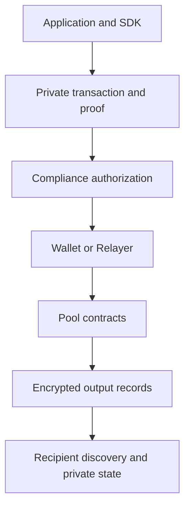

Arcane Privacy Layer lets you deposit funds, send private transfers, and withdraw to public addresses. Your application uses the Arcane Privacy SDK to construct transactions while the blockchain verifies their validity without reading private balances.

Your application keeps control of its interface, accounts, business rules, and records. Privacy Layer supplies the private transaction protocol; Compliance Platform supplies the protected policy and disclosure workflows.

## System at a glance

This protocol section describes the Stellar architecture.

Settlement combines three independent requirements: a valid private state transition, the required compliance approval, and an authorized execution context. A proof does not grant policy approval. A compliance decision does not grant ownership. A relayer does not gain the right to redirect funds.

## Explore the protocol

<CardGroup cols={2}>
  <Card title="Core concepts" href="/products/privacy-layer/core-concepts">
    Understand notes, private addresses, commitments, and application domains.
  </Card>
  <Card title="Transactions" href="/products/privacy-layer/transactions">
    Follow deposits, transfers, and withdrawals through settlement.
  </Card>
  <Card title="Pool contracts" href="/products/privacy-layer/protocol-components/pool-contracts">
    See how the pool verifies transactions and updates state atomically.
  </Card>
  <Card title="Zero-knowledge proofs" href="/products/privacy-layer/protocol-components/zero-knowledge-proofs">
    Understand what the proof establishes and the cryptographic assumptions.
  </Card>
  <Card title="Relayer" href="/products/privacy-layer/protocol-components/relayer">
    Separate transaction submission from private ownership.
  </Card>
  <Card title="Compliance integration" href="/products/privacy-layer/protocol-components/compliance-integration">
    Connect private transactions to policy authorization and controlled disclosure.
  </Card>
</CardGroup>

## Privacy boundaries

Private transfers protect note contents and ownership links from public observers. Deposits still expose the funding account, asset, and amount. Withdrawals expose the public destination, asset, and amount.

Relaying does not hide client connections from the relayer or remove timing and network metadata. Authorized compliance infrastructure can access the audit data required for its purpose. The protocol does not provide unconditional anonymity.

## Build with Arcane

Start with [SDK setup](/products/privacy-layer/sdk/integration/getting-access), then follow the [frontend](/products/privacy-layer/sdk/application-development/setup) or [backend](/products/privacy-layer/sdk/integration/backend) example.

For the separate Solana integration path, see [Solana integration](/products/privacy-layer/integration/solana/integration-overview). Do not apply Stellar contract or cryptographic details to another network.

{/* Source: engineering paper sections 1–2 and 7. */}
