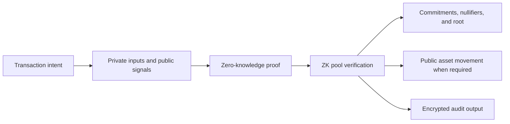

The Privacy Layer uses a zero-knowledge pool to separate private transaction
details from public blockchain settlement.

Instead of publishing an ordinary account-to-account payment record, the pool
tracks cryptographic commitments, state roots, nullifiers, and proofs. Public
asset movement remains visible when value enters or leaves the pool.

<Info>
  This section describes the common ZK pool model. Contract interfaces and
  supporting infrastructure can differ by network.
</Info>

## Architecture flow

## Main boundaries

| Boundary | Responsibility |
| --- | --- |
| **Application** | Collects the transaction intent, obtains authorization, and presents the result. |
| **Private transaction state** | Represents private outputs through commitments, roots, nullifiers, and encrypted data. |
| **ZK pool** | Checks authorization, the accepted state root, unused nullifiers, and proof validity. |
| **Blockchain settlement** | Records the pool state update and any public deposit or withdrawal movement. |
| **Disclosure path** | Emits encrypted audit data for a separate authorized review workflow. |

## What the proof establishes

The proof lets the pool verify that a transaction follows its rules without
publishing the private inputs used to create it. The pool can then:

- confirm that the input belongs to an accepted pool state;
- reject an input whose nullifier was already used;
- add new commitments and update the pool root;
- execute a public asset leg when the operation deposits or withdraws value.

<Note>
  Zero-knowledge privacy does not hide every blockchain signal. The contract
  invocation, state changes, and public deposit or withdrawal legs remain part
  of public network state.
</Note>

## Read next

<Columns cols={2}>
  <Card
    title="ZK pool model"
    icon="circles-overlap"
    href="/products/privacy-layer/architecture/zk-pool-model"
  >
    Learn how commitments, roots, nullifiers, and proofs work together.
  </Card>

  <Card
    title="Disclosure policy"
    icon="eye"
    href="/products/privacy-layer/sdk/concepts/disclosure-policy"
  >
    Understand how an operation controls field visibility.
  </Card>
</Columns>

{/* TODO: Add approved network-specific contract diagrams. */}
