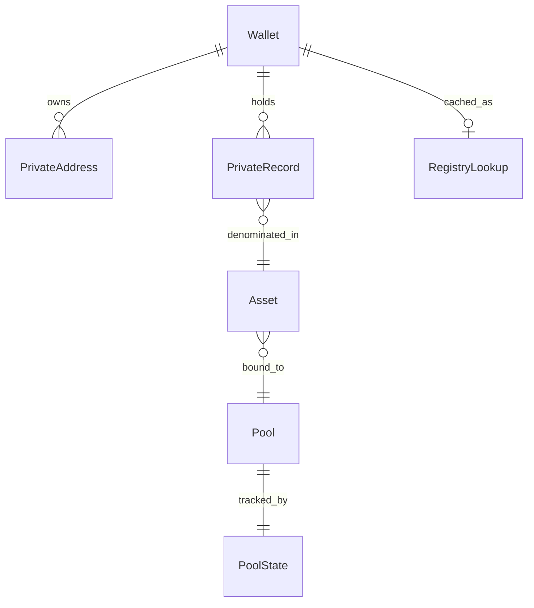

Before writing integration code, understand the domain objects the SDK reads and writes. These concepts are **multi-chain** — address formats and contract names depend on your network preset.

## Address types

| Concept | Description |
| --- | --- |
| **Public wallet address** | The on-chain identifier for a user's wallet in the target network. Used for public deposits, withdrawals, and unregistered-recipient transfers. |
| **Private payment address** | An address format used for private pool notes. Appears in `from` or `to` when moving value inside the privacy pool. Format is preset-specific — see [Stellar preset](/products/privacy-layer/sdk/overview/packages#stellar-preset) for the shipped Stellar layout. |

**Typical patterns:**

- **Deposit** — `from` public wallet, `to` private payment address.
- **Withdraw** — `from` private payment address, `to` public wallet.
- **Transfer** — both sides are usually private payment addresses; unregistered recipients use a public wallet `to` with onboarding at execute time.

## Private address registry

The registry links public wallet owners to their private payment addresses.

| Status | Meaning |
| --- | --- |
| `registered` | Owner completed onboarding; private address is known. |
| `unregistered` | Owner has no private address yet; transfers may create a pending claim. |
| `checking` | Registration status is being resolved. |

The SDK caches registry lookups in local state so prepare can resolve recipients without a round trip on every click.

## Assets and pool binding

Your asset catalog maps human-readable asset IDs (for example `usdc`) to on-chain token identifiers and the privacy **pool contract** that holds notes for that asset. The preset uses this binding when building transactions.

Populate the catalog from your backend in production — see [Data sources](/products/privacy-layer/sdk/integration/data-sources).

## Private records (notes)

A **private record** represents spendable balance inside the pool:

| Field | Role |
| --- | --- |
| `id` | Commitment identifier (stable record key) |
| `owner` | Public wallet address of the note owner |
| `privateAddress` | Private payment address associated with the note |
| `asset` | Asset ID from your catalog |
| `amount` | Note value |
| `consumed` | `true` after the note is spent |
| `coinNote` | Secret material stored **locally only** — required for spending |

After a successful withdraw or transfer, spent records are marked consumed and change notes may appear as new records.

## Pool state

The pool maintains a Merkle structure of commitments. The SDK caches:

- commitment list and count
- current Merkle root hash
- last update timestamp

Prepare reads this snapshot to validate that notes reference the current pool state. Sync the snapshot from chain events or your indexer — see [Data sources](/products/privacy-layer/sdk/integration/data-sources).

## Wallet secrets in state

Each wallet owner may have:

- a **private address record** (nonce, private payment address, creation time)
- a **scalar** derived from wallet authorization — used during transaction preparation

These values never leave the client in plaintext and must not appear in server-side responses your app exposes.

<Warning>
  Treat wallet scalars and `coinNote` secrets like private keys. Persist them only through your chosen state adapter and per-wallet storage policy.
</Warning>

## Pending claims

When you transfer to an **unregistered** recipient (public wallet `to`), the preset can attach an **onboarding payload** at execute time. The recipient later registers and claims the pending note through your application flow.

Preset-specific hooks for this path are documented in [Transfer to unregistered recipient](/products/privacy-layer/sdk/application-development/how-to/transfer-unregistered-recipient).

## Entity relationships

## Related

<CardGroup cols={2}>
  <Card title="Operations" icon="arrow-right-arrow-left" href="/products/privacy-layer/sdk/concepts/operations">
    How deposit, withdraw, and transfer use these entities.
  </Card>
  <Card title="Data sources" icon="server" href="/products/privacy-layer/sdk/integration/data-sources">
    Where production data for each entity comes from.
  </Card>
  <Card title="Security and privacy" icon="shield" href="/products/privacy-layer/sdk/concepts/security-and-privacy">
    What stays local vs on-chain.
  </Card>
</CardGroup>
