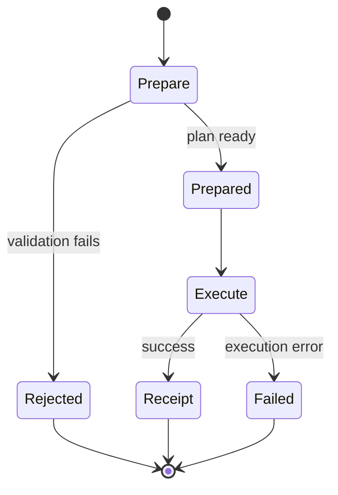

import { LifecycleFlow } from '../snippets/lifecycle-flow.jsx';

Every `deposit`, `transfer`, and `withdraw` call follows the same lifecycle. Understanding the two phases helps you build UI that fails fast and shows meaningful progress.

## Two-phase model

| Phase | When | What happens |
| --- | --- | --- |
| **Prepare** | `await client.deposit(intent)` (or transfer/withdraw) | Validate intent, read SDK state, check disclosure policy, plan consumed/output records |
| **Execute** | `await operation.execute(options)` | Wallet authorization, build transaction, compliance checks, submit, confirm, persist state |

Prepare runs **before** the wallet prompt so validation errors (`insufficient_state`, `unsupported_disclosure`) surface without a signature request. Execute is **one-shot** — calling `execute()` twice on the same prepared operation throws an execution error.



## Prepare outcomes

### Rejected

```ts
const operation = await client.withdraw(intent);

if (operation.status === 'rejected') {
  for (const error of operation.errors) {
    console.error(error.code, error.message);
  }
  return;
}
```

Do **not** call `execute()` when `status === 'rejected'`. Inspect `operation.errors` — an array of structured `PrivacySdkError` values.

### Prepared

When `status === 'prepared'`, the operation includes:

| Property | Meaning |
| --- | --- |
| `kind` | `deposit`, `transfer`, or `withdraw` |
| `intent` | Echo of your input for confirmation screens |
| `prepared` | Network-specific plan: selected notes, expected outputs, transact artifacts |
| `execute()` | Async function — run once to submit the transaction |

The `prepared` payload is useful for advanced UI (showing change amounts) but you can treat it as opaque for basic integrations.

## Execute flow and progress events

Pass `onEvent` to receive stage updates during execute:

```ts
await operation.execute({
  onEvent(event) {
    if (event.status === 'begin') {
      console.log(`Starting ${event.stage}`);
    }
    if (event.status === 'error' && event.error) {
      console.error(event.error.code, event.message);
    }
  },
});
```

<LifecycleFlow />

| Stage | Typical activity |
| --- | --- |
| `validation` | Final intent checks |
| `stateRead` | Load private records, pool snapshot, registry cache |
| `authorization` | Wallet message or transaction signing |
| `preparation` | Build private transaction payload |
| `policyCheck` | Disclosure and compliance validation |
| `submission` | Submit to the target blockchain |
| `confirmation` | Wait for inclusion/finality |
| `storageCommit` | Write updated records and pool state locally |

You can also pass `signal: AbortSignal` to cancel long-running execute work.

## Error model

| Code | Typical cause | Recoverable |
| --- | --- | --- |
| `unsupported_disclosure` | Disclosure combo not allowed for this route | Yes — adjust disclosure |
| `missing_dependency` | Client missing wallet, state, network, or policy | Yes — fix bootstrap |
| `invalid_intent` | Malformed or inconsistent intent field | Yes — fix user input |
| `insufficient_state` | Missing notes, stale pool root, unknown recipient | Yes — sync state and retry |
| `user_rejected` | Wallet declined signing | Yes — user can retry |
| `execution_error` | Submission or confirmation failed | Usually no — inspect `stage` |
| `unsupported_operation` | Operation not implemented for preset | No |

**Prepare-time** errors appear in `operation.errors` when `status === 'rejected'`.

**Execute-time** errors arrive through progress events (`status: 'error'`) or as thrown/rejected promises from `execute()`.

## Persisted state after success

On the `storageCommit` stage the SDK updates local domain state:

- mark spent private records as `consumed`
- insert new output records (recipient note, change note)
- refresh pool commitment snapshot
- append delivery metadata when configured

If you use a Redux adapter with localStorage hydration, persist the SDK state branch per wallet owner so records survive reloads — see [State integration](/products/privacy-layer/sdk/integration/state-integration) and [Setup](/products/privacy-layer/sdk/application-development/setup).

## Related

<CardGroup cols={2}>
  <Card title="Operations" icon="arrow-right-arrow-left" href="/products/privacy-layer/sdk/concepts/operations">
    Domain semantics for each operation kind.
  </Card>
  <Card title="State integration" icon="database" href="/products/privacy-layer/sdk/integration/state-integration">
    Why prepare reads SDK state.
  </Card>
  <Card title="Disclosure policy" icon="eye" href="/products/privacy-layer/sdk/concepts/disclosure-policy">
    Policy errors during prepare and execute.
  </Card>
</CardGroup>
