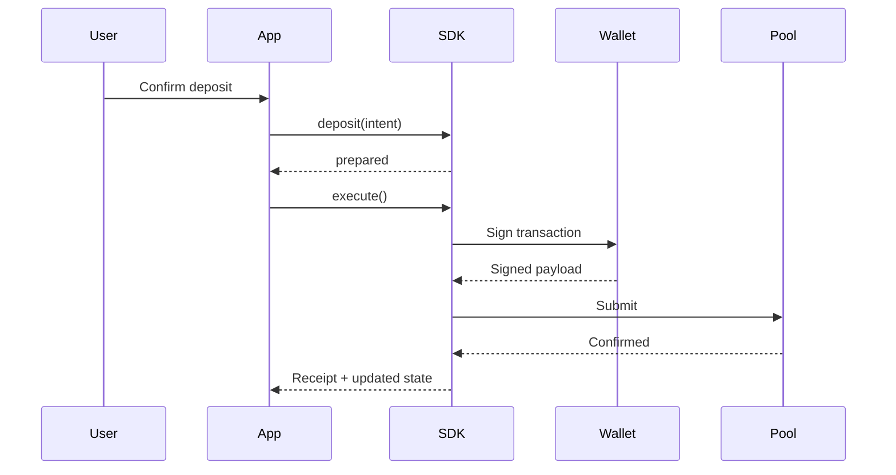

import { OperationDisclosures } from '../snippets/operation-disclosures.jsx';

Every privacy operation shares the same intent shape and the same **prepare → execute** lifecycle. This page describes what each operation does at the domain level, without chain-specific wiring.

For Stellar code examples, see [Stellar application development](/products/privacy-layer/sdk/application-development/how-to/deposit).

## Shared operation inputs

| Field | Meaning |
| --- | --- |
| `from` | Source address — public wallet or private payment address depending on the operation |
| `to` | Destination address — same address types as `from` |
| `asset` | Asset ID from your catalog |
| `amount` | Transfer amount in the asset's smallest unit |
| `disclosure` | Per-field on-chain visibility — see [Disclosure policy](/products/privacy-layer/sdk/concepts/disclosure-policy) |

```ts
const operation = await client.deposit({
  from: '...',
  to: '...',
  asset: 'usdc',
  amount: 50_0000000n,
  disclosure: {
    senderAddress: 'public',
    recipientAddress: 'private',
    assetAddress: 'public',
    amount: 'public',
  },
});
```

## Deposit

Move value from a **public wallet balance** into a **private pool note**.

1. **Prepare** — validate asset catalog, pool state, wallet secrets, and disclosure policy.
2. **Execute** — sign and submit the pool deposit; emit encrypted audit data per policy.
3. **After success** — SDK adds a new private record and updates pool state in local storage.

**Typical disclosure:**

<OperationDisclosures operation="deposit" />

## Withdraw

Spend a **private pool note** and pay out to a **public wallet**.

1. **Prepare** — select note(s) covering the amount, validate pool root, check disclosure.
2. **Execute** — submit pool withdrawal; move public asset to the recipient account.
3. **After success** — mark consumed record(s); persist change note if amount exceeds withdrawal.

**Typical disclosure:**

<OperationDisclosures operation="withdraw" />

## Transfer to registered recipient

Spend a sender note and create output note(s) for a recipient who is **already in the registry cache**.

1. **Prepare** — resolve recipient private payment address from registry lookup; validate sender balance.
2. **Execute** — submit pool transact with recipient output and optional sender change.
3. **After success** — update consumed/sender records and add recipient/change records.

**Typical disclosure:**

<OperationDisclosures operation="transfer-registered" />

## Transfer to unregistered recipient (pending claim)

Send to a **public wallet** when the recipient has not registered a private address yet.

1. **Prepare** — validate sender state and disclosure (recipient/asset/amount usually public).
2. **Execute** — preset attaches onboarding payload so the recipient can claim later.
3. **After success** — sender note consumed; pending claim indexed by your backend.

Requires preset-specific `transactEnvironment` hooks. See [Transfer to unregistered recipient](/products/privacy-layer/sdk/application-development/how-to/transfer-unregistered-recipient).

**Typical disclosure:**

<OperationDisclosures operation="transfer-unregistered" />

## Operation comparison

| Operation | Typical `from` | Typical `to` | Registry | Compliance check |
| --- | --- | --- | --- | --- |
| Deposit | Public wallet | Private payment | Optional | Often yes |
| Withdraw | Private payment | Public wallet | No | Often yes |
| Transfer (registered) | Private payment | Private payment | Required cache | Often yes |
| Transfer (unregistered) | Private payment | Public wallet | Unregistered lookup | Often yes |

<Note>
  Concrete Stellar addresses, seed-state fixtures, and full code blocks live in the [Stellar how-to guides](/products/privacy-layer/sdk/application-development/how-to/deposit). Seed state blocks are **documentation fixtures**, not production onboarding — see [Data sources](/products/privacy-layer/sdk/integration/data-sources).
</Note>

## Deposit sequence



## Related

<CardGroup cols={2}>
  <Card title="Operation lifecycle" icon="timeline" href="/products/privacy-layer/sdk/concepts/operation-lifecycle">
    Prepare, execute, errors, and progress events.
  </Card>
  <Card title="Disclosure policy" icon="eye" href="/products/privacy-layer/sdk/concepts/disclosure-policy">
    Public vs private fields per route.
  </Card>
  <Card title="Data sources" icon="server" href="/products/privacy-layer/sdk/integration/data-sources">
    Production vs fixture state.
  </Card>
</CardGroup>
