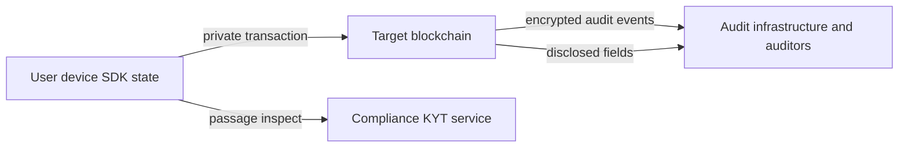

Private payments require clear trust boundaries. This page summarizes what the SDK stores locally, what reaches the blockchain, and what auditors and compliance services can see.

## Trust boundaries

| Boundary | Responsibility |
| --- | --- |
| **User device** | Wallet keys, note secrets, SDK state persistence |
| **Target blockchain** | Commitments, nullifiers, disclosed fields, encrypted audit events |
| **Compliance (KYT)** | Policy screening on passage payloads when configured |
| **Audit infrastructure** | Encrypted audit decryption and case interpretation |

## Stored locally (SDK state)

The SDK cache on the client may contain:

- private records and `coinNote` secrets/nullifiers
- wallet private-address records and scalars
- pool commitment snapshot and Merkle root
- registry lookup cache
- asset catalog rows

<Warning>
  Persistence is your application's responsibility. localStorage, Redux persistence, and IndexedDB each carry different exfiltration and backup risks. Scope storage per wallet owner and encrypt at rest when required by your threat model.
</Warning>

**Never** return wallet scalars or note secrets from APIs your application exposes.

## Published on-chain

Depending on the operation and disclosure policy, chain-visible data can include:

- note commitments and nullifiers
- disclosed sender/recipient/asset/amount fields
- encrypted audit event payloads
- output note events (ciphertext for note delivery)

**Not** published on-chain:

- note secrets and nullifier preimages
- wallet authorization scalars used only during preparation

## Visible to auditors

Auditors authorized for your application receive:

- **Encrypted audit blobs** — decryptable with auditor keys configured in your audit infrastructure
- **Publicly disclosed fields** — exactly those marked `public` in the operation disclosure

Private disclosure fields are not published as plaintext on-chain; interpretation relies on encrypted audit channels.

## KYT and passage registry

When KYT is configured on the network preset, the SDK may submit a **passage inspect** request before submission. High-level payload contents include hashed public signals and passage metadata — not local note secrets.

The integration **fails closed**: if compliance rejects the passage, execute stops before submission.

## Wallet signing surface

Prepare/execute may request:

- **Message authorization** — proves control of a private payment address
- **Transaction signing** — signs the prepared transaction payload for the target network

Review wallet prompts carefully in UI copy so users understand what they authorize.

## Integrator checklist

Before production:

- [ ] Persist SDK state per wallet with an explicit security review of your storage medium
- [ ] Sync pool state and private records from trusted indexers, not manual fixtures
- [ ] Configure disclosure defaults per operation route with compliance input
- [ ] Keep audit public keys and application IDs in environment configuration, not source control
- [ ] Test KYT failure paths — users should see actionable errors, not silent retries
- [ ] Never log note secrets, scalars, or decrypted audit plaintext in client analytics

## Related

<CardGroup cols={2}>
  <Card title="Disclosure policy" icon="eye" href="/products/privacy-layer/sdk/concepts/disclosure-policy">
    Field-level visibility rules.
  </Card>
  <Card title="Data sources" icon="server" href="/products/privacy-layer/sdk/integration/data-sources">
    Trusted production data flows.
  </Card>
  <Card title="Domain model" icon="sitemap" href="/products/privacy-layer/sdk/concepts/domain-model">
    Entities stored in SDK state.
  </Card>
</CardGroup>
