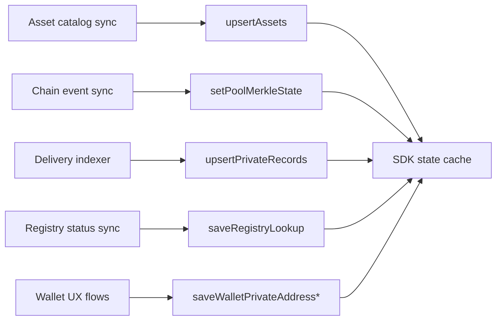

import { DataSourceLegend } from '../snippets/data-source-legend.jsx';

SDK state can be populated manually for tutorials, but production applications load domain data from **trusted services** and **chain sync**. This page separates the two.

<Warning>
  **Seed state** blocks in [Deposit](/products/privacy-layer/sdk/application-development/how-to/deposit), [Withdraw](/products/privacy-layer/sdk/application-development/how-to/withdraw), and [Transfer](/products/privacy-layer/sdk/application-development/how-to/transfer-registered-recipient) how-to guides are **documentation fixtures**. They exist so examples run in isolation. Do not ship them as user onboarding flows.
</Warning>

<DataSourceLegend />

## Production data flow

Your application orchestrates these writes **before** users submit operations, keeping prepare reliable.

## SDK method × typical source

| SDK write | Production source | Doc fixture |
| --- | --- | --- |
| `upsertAssets` | Your backend asset catalog | Hardcoded catalog row |
| `setPoolMerkleState` | Chain scanner or SDK sync after events | Static root and commitments |
| `upsertPrivateRecords` | Delivery polling / output-note decryption | Manual `coinNote` object |
| `saveRegistryLookup` | `checkRegistrationStatus` or registry poll | Hardcoded lookup row |
| `saveWalletPrivateAddressRecord` | Wallet private-address creation flow | Static `stpl1` address |
| `saveWalletPrivateAddressScalar` | Wallet signature during address setup | Static scalar hex |

## What runs automatically on execute

After a successful operation, the SDK updates local state without manual calls:

- mark spent records as consumed
- insert output and change records
- refresh pool commitment snapshot
- record delivery metadata when configured

Label these updates **SDK auto** in your mental model — not fixtures and not backend-fed.

## Stellar preset examples {#stellar-preset-examples}

For the shipped Stellar preset, production wiring typically looks like:

| Data | Stellar-specific source |
| --- | --- |
| Asset rows | Asset catalog from your backend (includes `clientContract` and `poolContract` Soroban IDs) |
| Pool Merkle state | Pool event scanner or client sync against Soroban RPC |
| Private records | Incoming delivery sync and output-note handling in your payment app |
| Registry lookup | On-chain registry simulate + `checkRegistrationStatus` |
| Pending claims index | Pending-claims list from your backend (filtered by owner and asset) |
| Audit interpretation | Encrypted audit event indexing and interpretation in your stack |

<Warning>
  How-to **Seed state** sections use example `G...` and `stpl1...` addresses and static hex commitments. Treat them as copy-paste fixtures for docs only.
</Warning>

### Minimal Stellar production checklist

- [ ] Asset catalog synced from backend before showing balances
- [ ] Pool Merkle state kept current via scanner or post-tx sync
- [ ] Wallet private-address and scalar created through wallet UX, not hardcoded
- [ ] Registry status fetched before registered-recipient transfers
- [ ] Deliveries indexer populates `upsertPrivateRecords` for incoming notes
- [ ] Environment variables set for pool, registry, application ID, audit public key

## Related

<CardGroup cols={2}>
  <Card title="Domain model" icon="sitemap" href="/products/privacy-layer/sdk/concepts/domain-model">
    What each state entity represents.
  </Card>
  <Card title="Operations" icon="arrow-right-arrow-left" href="/products/privacy-layer/sdk/concepts/operations">
    Which entities each operation consumes.
  </Card>
  <Card title="Deposit how-to" icon="book" href="/products/privacy-layer/sdk/application-development/how-to/deposit">
    Fixture seed state example.
  </Card>
  <Card title="State integration" icon="database" href="/products/privacy-layer/sdk/integration/state-integration">
    Adapter libraries for persisting SDK state.
  </Card>
</CardGroup>
