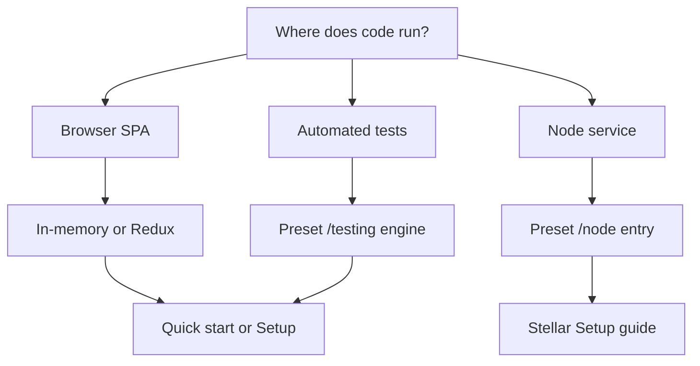

Pick an integration path based on where your code runs and which network preset you target. Core concepts are multi-chain; the Stellar preset is documented as the first shipped path.

## Choose your runtime

| Runtime | Best for | State adapter |
| --- | --- | --- |
| **Browser SPA** | Wallet-connected payment UI | In-memory (learn) or Redux (production React) |
| **Node service** | Server-side signing or batch jobs | In-memory or custom persistence |
| **Automated tests** | Unit and integration tests | In-memory + preset testing helpers |



## Stellar preset path

For **Stellar + Soroban** applications:

1. Install `@arcanetech/privacy-sdk-stellar` and a state adapter — see [Quick start](/products/privacy-layer/sdk/integration/quick-start) or [Install](/products/privacy-layer/sdk/application-development/install).
2. Load bundled runtime assets with `loadDefaultStellarBrowserAssets()` (browser) or filesystem paths via `@arcanetech/privacy-sdk-stellar/node`.
3. Implement a **Stellar wallet adapter** (`getAddress`, `authorizeMessage`, `signTransactionPayload`).
4. Pass **`transactEnvironment`** with Soroban RPC URL, pool/registry contract IDs, KYT config, and `signTransaction`.
5. Create the client once at app startup.

Full React + Redux wiring: [Setup](/products/privacy-layer/sdk/application-development/setup).

## Node path (Stellar preset)

Use `@arcanetech/privacy-sdk-stellar/node` when assets load from disk and a server-side wallet holds signing keys.

```ts
import { createStellarPrivacyClientFromNodeConfig } from '@arcanetech/privacy-sdk-stellar/node';
```

Supply filesystem paths for bundled runtime assets and the same network, wallet, and state adapters as the browser path.

## Test path (Stellar preset)

Use `@arcanetech/privacy-sdk-stellar/testing` to inject a **fake transact engine** and `@arcanetech/privacy-sdk-state-memory` for isolated state:

```ts
import { createFakeTransactEngine } from '@arcanetech/privacy-sdk-stellar/testing';
import { createInMemoryStateAdapter } from '@arcanetech/privacy-sdk-state-memory';
```

Tests can call `prepare` and `execute` without a live Soroban RPC endpoint.

## What you bring vs what the SDK brings

| You supply | SDK supplies |
| --- | --- |
| Network preset configuration (RPC, contracts, application ID) | Operation orchestration (prepare/execute) |
| Wallet adapter | Transaction preparation and submission |
| State adapter library | Domain state reads/writes during lifecycle |
| Audit public key and disclosure choices | Policy validation for supported routes |
| Backend-provided asset, delivery, and registry data (production) | Progress events and structured errors |
| Runtime assets loader (browser or Node) | Bundled assets inside Stellar preset package |

## Recommended reading order

1. [Introduction](/products/privacy-layer/sdk/overview/introduction) and [Packages](/products/privacy-layer/sdk/overview/packages)
2. [Domain model](/products/privacy-layer/sdk/concepts/domain-model) and [Operation lifecycle](/products/privacy-layer/sdk/concepts/operation-lifecycle)
3. [Quick start (Stellar preset)](/products/privacy-layer/sdk/integration/quick-start)
4. [State integration](/products/privacy-layer/sdk/integration/state-integration) and [Data sources](/products/privacy-layer/sdk/integration/data-sources)
5. [Stellar application development](/products/privacy-layer/sdk/application-development/install) for production React wiring

## Related

<CardGroup cols={2}>
  <Card title="Quick start (Stellar preset)" icon="rocket" href="/products/privacy-layer/sdk/integration/quick-start">
    Minimal in-memory bootstrap.
  </Card>
  <Card title="State integration" icon="database" href="/products/privacy-layer/sdk/integration/state-integration">
    Memory vs Redux adapters.
  </Card>
  <Card title="Setup" icon="wrench" href="/products/privacy-layer/sdk/application-development/setup">
    Production Stellar React shell.
  </Card>
</CardGroup>
