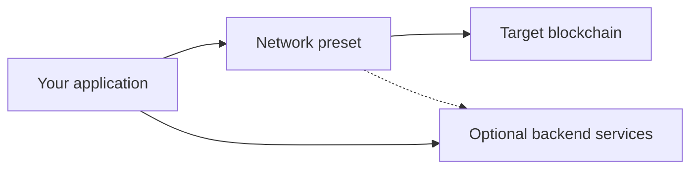
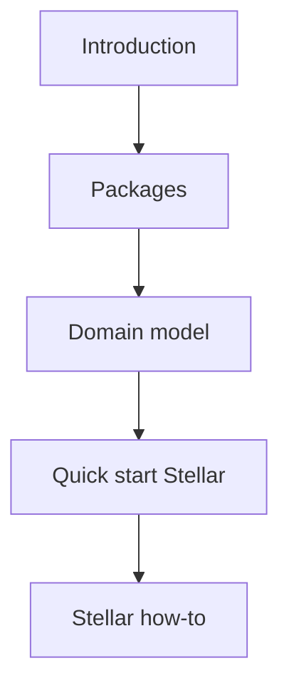

The Privacy Layer SDK is a high-level **multi-chain** TypeScript library for auditable private payments. It gives your application a stable domain API — `deposit`, `transfer`, and `withdraw` — while hiding low-level cryptography and chain orchestration inside **network presets**.

## What the SDK is

The SDK splits into two layers:

| Layer | Packages | Role |
| --- | --- | --- |
| **Core + state** | `@arcanetech/privacy-sdk-core`, `@arcanetech/privacy-sdk-state-*` | Chain-agnostic intents, operation lifecycle, errors, progress events, pluggable state |
| **Network preset** | `@arcanetech/privacy-sdk-stellar` (first shipped preset) | Binding to a specific blockchain: contracts, wallet format, bundled runtime assets |

The SDK **orchestrates** private transactions on the client and maintains a **local cache** of domain state (private records, pool snapshot, registry lookups, wallet keys). It does **not** replace your backend or indexer — those services still supply asset catalogs, delivery indexing, and audit interpretation.

<Note>
  Stellar and Soroban details appear only in the [Stellar preset](/products/privacy-layer/sdk/overview/packages#stellar-preset) section, [Quick start (Stellar preset)](/products/privacy-layer/sdk/integration/quick-start), and [Stellar application development](/products/privacy-layer/sdk/application-development/install) how-to guides.
</Note>

## Problems it solves

Without the SDK, every application must manually assemble transaction inputs, validate pool state, enforce disclosure rules, drive wallet signing, and persist private records. The SDK provides:

- A **two-phase operation model** — `prepare` validates and plans; `execute` signs, submits, and persists — so UI can show errors before the wallet prompt.
- **Typed errors** and **progress events** for loading states and retry logic.
- **Pluggable state** through adapter libraries (in-memory, Redux) instead of locking you to one state manager.
- **Extensibility** — new chain presets can ship without changing the core intent and lifecycle API.

## What you can build

- A multi-chain wallet or payment client (Stellar is the first shipped preset).
- Embedded private transfers inside an existing dApp on a supported network.
- A backend signing service using a preset's Node entrypoint (you supply a server-side wallet adapter).
- Automated test harnesses and CI pipelines with fake transact engines — no live chain required.

## How documentation is organized

Read in this order:

1. **Overview** — product scope and package map (multi-chain).
2. **Concepts** — domain model, operations, lifecycle, disclosure, security (multi-chain).
3. **Integration** — runtime paths, quick start, state adapters, production data sources.
4. **Stellar application development** — full React + Redux wiring and operation how-to guides.

## Related

<CardGroup cols={2}>
  <Card title="Packages" icon="cube" href="/products/privacy-layer/sdk/overview/packages">
    Map of `@arcanetech/*` packages and the Stellar preset.
  </Card>
  <Card title="Integration paths" icon="route" href="/products/privacy-layer/sdk/integration/integration-paths">
    Choose browser, Node, or test runtime.
  </Card>
  <Card title="Quick start (Stellar preset)" icon="rocket" href="/products/privacy-layer/sdk/integration/quick-start">
    Minimal in-memory example without Redux.
  </Card>
  <Card title="Domain model" icon="sitemap" href="/products/privacy-layer/sdk/concepts/domain-model">
    Addresses, records, pool, and registry concepts.
  </Card>
</CardGroup>
