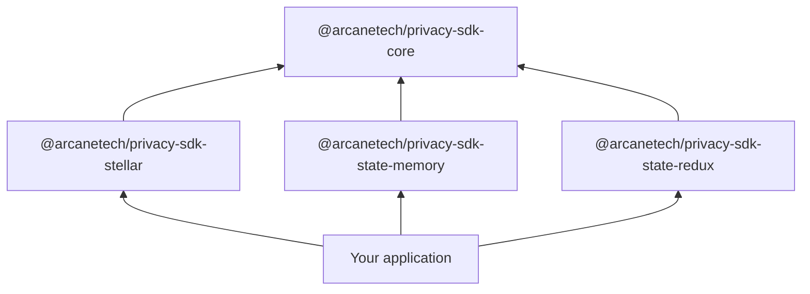
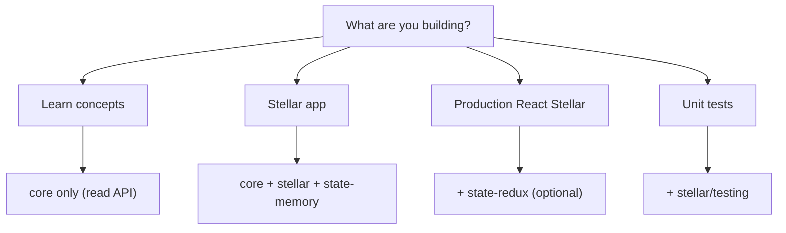

import { PackageMatrix } from '../snippets/package-matrix.jsx';

All public packages use the `@arcanetech` scope. You install presets and state adapters explicitly; **no additional cryptography packages** are required for browser or Node usage.

## Package map

<PackageMatrix />

`@arcanetech/privacy-sdk-stellar` ships bundled runtime assets for browser and Node. Your application passes network configuration, wallet adapter, state adapter, and policy — the preset handles the rest.

## Layered architecture

- **Core** — network-agnostic orchestration: intents, prepare/execute lifecycle, errors, progress events.
- **State adapters** — pluggable persistence for SDK domain state; work with any frontend or backend storage stack.
- **Network presets** — chain-specific clients, contract bindings, and state schema extensions.

Internal transitive dependencies are not part of the public integration surface.

## Entry points and subpaths

**Multi-chain (chain-agnostic):**

| Import | Purpose |
| --- | --- |
| `@arcanetech/privacy-sdk-core` | Intents, lifecycle helpers, error types, progress events |
| `@arcanetech/privacy-sdk-state-memory` | In-memory state adapter for prototypes and tests |
| `@arcanetech/privacy-sdk-state-redux` | Redux Toolkit adapter for React apps |

**Stellar preset:**

| Import | Purpose |
| --- | --- |
| `@arcanetech/privacy-sdk-stellar` | Browser client factory and Stellar types |
| `@arcanetech/privacy-sdk-stellar/node` | Node client with filesystem asset loading |
| `@arcanetech/privacy-sdk-stellar/testing` | Fake transact engine for unit tests |

## Stellar preset {#stellar-preset}

`@arcanetech/privacy-sdk-stellar` is the first shipped network preset. It targets **Stellar** with **Soroban** smart contracts:

- **Pool contract** — private deposits, transfers, and withdrawals.
- **Private-address registry** — maps public Stellar accounts to private payment addresses.
- **Soroban RPC** — submission and confirmation.
- **`createStellarPrivacyClient()`** — main browser entrypoint.

**Address model (Stellar only):**

| Type | Format | Used for |
| --- | --- | --- |
| Public wallet | Stellar `G...` account | On-chain identity, public payouts |
| Private payment | `stpl1...` address | Pool notes and private sends |

**Bootstrap helpers:**

- `loadDefaultStellarBrowserAssets()` — bundled runtime assets for the browser.
- `transactEnvironment` — network, KYT, and transaction signing hooks passed at client creation.

For full React wiring and operation examples, continue to [Stellar application development](/products/privacy-layer/sdk/application-development/install).

<Note>
  Future chains will ship as separate `@arcanetech/privacy-sdk-<chain>` preset packages. Core and state adapter APIs stay unchanged.
</Note>

## Which packages you need

## Related

<CardGroup cols={2}>
  <Card title="State integration" icon="database" href="/products/privacy-layer/sdk/integration/state-integration">
    Choose in-memory or Redux state adapters.
  </Card>
  <Card title="Quick start (Stellar preset)" icon="rocket" href="/products/privacy-layer/sdk/integration/quick-start">
    Minimal Stellar client bootstrap.
  </Card>
  <Card title="Install" icon="download" href="/products/privacy-layer/sdk/application-development/install">
    Full Stellar React stack install.
  </Card>
</CardGroup>
