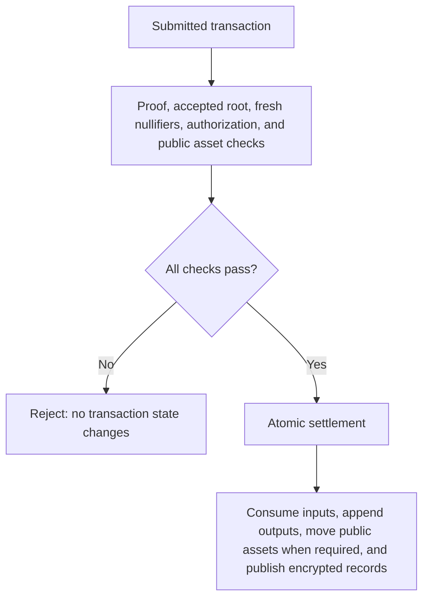

Deposits, private transfers, and withdrawals use the same private-note model. They differ in whether value enters or leaves the public boundary of the pool.

A transaction is complete on-chain only after settlement succeeds. Your application also needs the resulting private records to display and spend its updated balance.

## Prepare the transaction

The client selects unspent notes and a pool root, defines the recipient outputs and change, and constructs the encrypted recipient and audit records.

The proof establishes ownership, membership under the selected root, correct output construction, and conservation of value. The encrypted records are tied to the transaction's private data; they are not an unrelated description supplied for review.

A prepared transaction is not yet settled. Another transaction may spend an input, or the selected root may stop being accepted before submission.

## Obtain compliance authorization

The compliance path evaluates the transaction's encrypted audit data under the application's policy. A KYT passage supplies the authorization required for the transaction to proceed.

This decision is separate from ownership. A compliance service cannot replace the owner's witness or redirect the payment. Conversely, a valid ownership proof does not bypass the required policy approval.

Transaction-time authorization and later controlled disclosure are different workflows. See [Compliance Platform architecture](/products/compliance-platform/architecture/overview) for authorized access to audit data.

The passage is time-limited and consumed once at settlement. See [KYT authorization](/products/privacy-layer/protocol-components/compliance-integration#kyt-authorization) for the screening stages, provider failure behavior, and on-chain checks.

## Submit the transaction

The configured submission path sends the prepared transaction for settlement.

| Operation | Submission in the integration examples | Public asset movement |
| --- | --- | --- |
| Deposit | Direct submission signed by the funding wallet or server account | Account funds enter the pool |
| Private transfer | Relay for a private sender; escrow sends also require Relay | None |
| Withdrawal | Relay when the sender remains private | Pool funds leave for the public destination |

A relayer submits the transaction without receiving the ownership witness. Changing the transaction's recipients, values, or protected records invalidates the cryptographic checks that bind them.

The submitting account is not necessarily the note owner. Public funding still requires the appropriate account authorization.

## Verify and settle atomically

At settlement, the pool evaluates proof validity, accepted state, unused nullifiers, required compliance authorization, and public asset authorization.

The proof does not replace settlement-time checks. An input can have a valid membership proof and still be rejected because its nullifier was consumed by a competing transaction.

The state update, any public token movement, and publication of transaction records belong to one atomic settlement. They are not separate payments that can independently succeed.

## Discover outputs and update the application

After confirmation, the recipient discovers and validates encrypted output records. The application stores the resulting notes and updates its private balance and transaction history.

Chain confirmation and local discovery are distinct. A transaction can be settled while a recipient's application has not yet recovered its output.

Keep the transaction identifier and account context until reconciliation finishes. If submission times out, establish its outcome before creating a replacement payment.

## Build the integration

<CardGroup cols={2}>
  <Card title="Frontend integration" href="/products/privacy-layer/sdk/application-development/setup">
    Follow wallet signing, transaction submission, and account state in the browser.
  </Card>
  <Card title="Backend integration" href="/products/privacy-layer/sdk/integration/backend">
    Follow server-side signing and persistent account state.
  </Card>
</CardGroup>

{/* Source: Arcane Privacy Layer engineering paper, sections 4–5. Submission routes follow the current SDK guides and reference applications. */}
