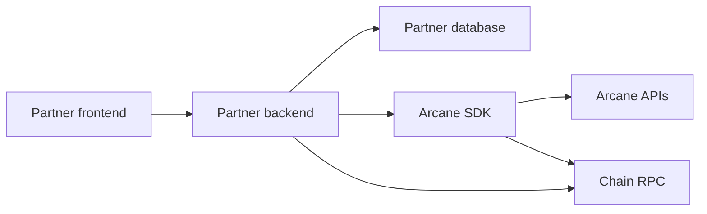

Backend-managed wallets are the recommended starting point for card funding, payroll, treasury, and other flows where your backend must coordinate product state, signing, transaction submission, and reconciliation.

In this model, the frontend never receives backend private keys, proof authority, decoded UTXOs, encrypted output caches, or relayer credentials.

## Architecture

## Backend responsibilities

| Area | Responsibility |
| --- | --- |
| Session and identity | Authenticate the user or product actor |
| Product state | Store card-load, payroll, payout, and treasury references |
| Wallet state | Store managed public keys and signing references |
| Private state | Persist scan state, UTXOs, encrypted outputs, and operation history |
| SDK calls | Deposit, scan, transfer, withdraw, and consolidate |
| Chain interaction | Detect public funding and confirm public withdrawals |
| Relayer submission | Submit signed privacy-layer transactions |
| Reconciliation | Link Arcane ids back to product ids |

## Suggested stored state

Use encrypted storage and managed signing in production.

| Table or store | Purpose |
| --- | --- |
| `wallets` | Owner wallet public key, managed public key, signing key reference, proof signature reference, and stealth deposit index |
| `arcane_utxo_scan_state` | Last scanned index, total indexer count, cache key, and scan mode |
| `arcane_utxos` | Decoded private state needed for spending and balance display |
| `arcane_utxo_encrypted_outputs` | Encrypted outputs used for recovery and scanning |
| `arcane_utxo_history` | Funding, shield, transfer, withdrawal, retry, and failure events |
| `product_references` | Card-load, payroll-cycle, customer, employee, treasury, or payout references |

Do not store raw backend private keys in plaintext. Use KMS, HSM, or a signing service.

The current Solana SDK UTXO helper uses browser-style `localStorage` for cache state. In a backend-managed integration, replace that with a server-side storage shim or equivalent persistence layer before production. Do not rely on browser local storage for decoded UTXOs, encrypted outputs, scan offsets, private keys, or proof signatures.

## Main flows

### Login or session restore

1. Authenticate the user or product actor.
2. Create or retrieve the private account.
3. Create or retrieve the managed key.
4. Initialize scan state.
5. Return only public context to the frontend.

### Balance scan

1. Query the Arcane indexer.
2. Decode outputs for the private account.
3. Persist scan state and decoded spendable state.
4. Return product-level balances to the frontend.

### Deposit and shield

1. Create a funding intent.
2. Watch the public funding address.
3. Confirm public funding.
4. Call the SDK deposit flow.
5. Submit through the relayer.
6. Wait for confirmation and indexing.
7. Mark private balance available.

### Private spend

1. Resolve recipient private account or key.
2. Scan spendable state.
3. Build private transfer.
4. Submit through the relayer.
5. Persist status history and audit record id.

### Withdrawal

1. Validate public recipient and product authorization.
2. Scan spendable state.
3. Build withdrawal.
4. Submit through the relayer.
5. Confirm public transaction and indexed private spend.

## Security guidance

- Keep signing keys and proof authority server-side.
- Use HttpOnly cookies or equivalent server-side session controls.
- Do not put private state in browser local storage.
- Use idempotency keys for funding, transfer, and withdrawal creation.
- Rate limit sensitive endpoints.
- Log access to audit records and disclosure workflows.
- Treat relayer, indexer, chain RPC, and prover failures as independent retry domains.
