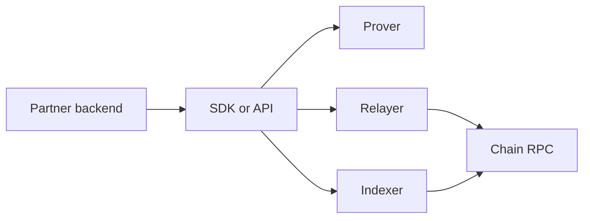

Arcane integrations interact with several infrastructure components. You usually do not need to expose these components to end users, but your backend should understand their failure modes.

## Components

| Component | Purpose |
| --- | --- |
| Indexer | Reads privacy-layer state and returns roots, proofs, outputs, and transaction history |
| Relayer | Submits privacy-layer transactions and tracks submission jobs |
| Prover | Generates zero-knowledge proofs for private transactions |
| Chain RPC | Confirms public funding, private-pool transactions, and withdrawals |
| SDK | Coordinates calls across indexer, prover, relayer, and chain RPC |

## Indexer

The indexer lets your backend:

- Read current tree root or pool state.
- Fetch Merkle proofs.
- Scan encrypted outputs.
- Track indexed transaction history.
- Confirm that private balance is available.

Indexing can lag chain confirmation. Your product state should distinguish `confirmed` from `indexed`.

## Relayer

The relayer submits transactions on behalf of the integration.

Typical capabilities include:

- Read relayer info.
- Submit signed transactions.
- Submit withdrawal jobs.
- Check job status.
- Wait for completion.

Treat relayer submission as separate from chain confirmation. A relayer job can fail before a transaction lands on-chain.

## Prover

The prover creates the proof required for private transactions. Depending on the rail and integration style, proof generation can happen in the SDK, a backend service, or a managed prover environment.

Your product should show normal processing language while proof generation runs.

## Operational model

## Failure boundaries

| Boundary | Product handling |
| --- | --- |
| Prover failure | Retry proof generation and keep the same product reference |
| Relayer failure | Retry submission with idempotency |
| Chain RPC failure | Switch provider or retry confirmation reads |
| Chain confirmation delay | Keep user-facing state in processing |
| Indexer lag | Wait for indexed state before spending or completing product ledger updates |

See [Failure Modes](/operations/failure-modes) for production handling.
