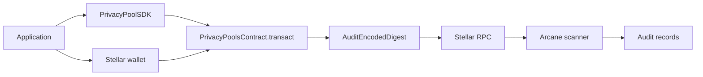

The Stellar integration path uses a Soroban privacy-pool contract, a client SDK, and Arcane indexing for controlled disclosure workflows.

Applications submit private-pool transactions to the Soroban contract. Arcane indexes registered contract events and prepares interpreted audit records for scoped review.

## Integration model



## Prerequisites

You need:

- A Stellar/Soroban network and RPC endpoint.
- A deployed `PrivacyPoolsContract`.
- Contract verification key and public slot configuration matching the circuit.
- Contract decoding key for audit interpretation.
- `@auditable/privacy-pool-zk-sdk` available to the application.
- A Stellar wallet integration.
- An Arcane organization and application record.
- Backend chain, contract, asset, and application registry rows.
- Scanner environment configured for the Stellar chain.

## Application setup

The application integrates the SDK and wallet.

1. Initialize `PrivacyPoolSDK`.
2. Derive a user stealth address from a Stellar wallet signature when the user receives private funds.
3. Read pool state needed for witness construction.
4. Build coin and transaction inputs.
5. Generate proof and public signals with `proveTransaction` or a higher-level SDK helper.
6. Prepare encrypted audit bytes for the `encoded` argument.
7. Ask the wallet to sign and submit `PrivacyPoolsContract.transact`.

`deposit`, `withdraw`, and `transfer` are user-facing transaction shapes. The contract call remains `transact`.

## Soroban call shape

The application submits:

```text
transact(from, proof_bytes, pub_signals_bytes, encoded)
```

| Argument | Source |
| --- | --- |
| `from` | Wallet-authenticated Stellar address |
| `proof_bytes` | SDK-serialized Groth16 proof |
| `pub_signals_bytes` | SDK-serialized public signals |
| `encoded` | Encrypted audit payload bytes |

After successful proof verification and state update, the contract emits `AuditEncodedDigest`.

## Arcane registry setup

Arcane indexes only registered contracts.

| Table | Required data |
| --- | --- |
| `chain` | Stellar chain name, `type = stellar`, RPC URL, optional network passphrase, optional initial ledger hint |
| `contracts` | Soroban contract address, `chain_id`, `decoding_key`, optional `encoding_key` |
| `assets` | Asset metadata and Stellar asset contract references |
| `asset_pool_contracts` | Links assets to pool contracts |
| `applications` | Organization application with `foreign_id`, application type, and contract association |
| `team_member_application_permissions` | Admin and auditor permission buckets for application users |

## Verification checklist

- Contract is deployed with expected tree depth, verification key, and public slot counts.
- Application can initialize `PrivacyPoolSDK`.
- Application can derive or import a `stpl1` stealth address.
- Application can generate proof bytes and public signal bytes.
- Wallet can submit `transact`.
- Contract stores commitments, nullifiers, and roots as expected.
- Contract emits `AuditEncodedDigest`.
- Chain and contract rows exist for the Stellar deployment.
- Scanner advances checkpoints and writes audit rows.
- Interpretation writes audit records.
- Auditor and administrator access works through the Auditing Portal.

## Related pages

<Columns cols={2}>
  <Card title="Client SDK internals" icon="code" href="/privacy-pools/client-sdk">
    Understand the lower-level Stellar SDK boundary.
  </Card>
  <Card title="Indexing and interpretation" icon="database" href="/auditing-portal/indexing-and-interpretation">
    See how Arcane reads Stellar events into audit records.
  </Card>
</Columns>
