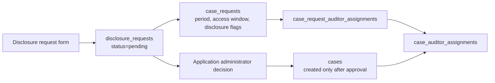

Auditors create disclosure requests when they need scoped access to interpreted private-pool transaction data for an investigation. A request is not an active case yet. The active `cases` row is created only after an application administrator approves the request.

## Prerequisites

- Access to an application workspace.
- `cases:create`.
- Optional for withdrawal: `cases:withdraw_pending_request`.

## Workflow

<Steps>
  <Step title="Open Case Review">
    Sign in and select the application workspace. In the sidebar, click **Case Review**.
  </Step>
  <Step title="Open the new request form">
    Use the create action in **Case Review** to open the disclosure request form.
  </Step>
  <Step title="Fill request summary">
    Enter the investigation basis and reason. Choose the transaction period and requested access window.
  </Step>
  <Step title="Choose disclosure scope">
    Select the fields requested for disclosure: transaction identifiers, sender information, and recipient/withdrawal information.
  </Step>
  <Step title="Assign auditors">
    Select team members who should access the case if approved. The session user is auto-selected when present in the assignable list.
  </Step>
  <Step title="Submit request">
    Submit the request. It appears in the pending queue until an application administrator approves or closes it.
  </Step>
</Steps>

## Request-to-case boundary

## Backend writes

| Table | Write |
| --- | --- |
| `disclosure_requests` | Parent request with organization, application, requester, reason, status, type, approvals required |
| `case_requests` | Investigation basis, period, access window, disclosure flags, future case id, contract filters |
| `case_request_auditor_assignments` | Proposed auditors before approval |
| `auditors_log` | Request-created activity after successful handler execution |

## Withdraw a pending request

If the auditor created a pending request and no longer needs it:

1. Open **Case Review**.
2. Find the pending case row.
3. Click **Withdraw**.

Withdrawal requires `cases:withdraw_pending_request`.

## Next state

| State | Meaning |
| --- | --- |
| `pending` | Waiting for application administrator action |
| `approved` | Active case created; assigned auditors can access scoped data |
| `closed` | Request closed without granting case access |

See [Approve a disclosure request](/use-cases/application-administrator/approve-disclosure-request) for the administrator workflow.
